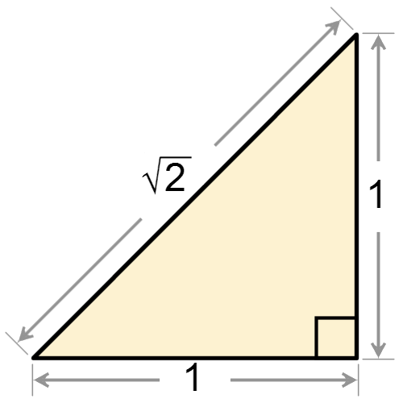
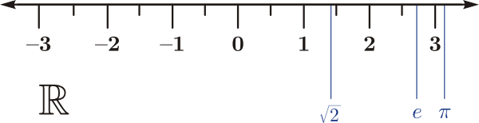
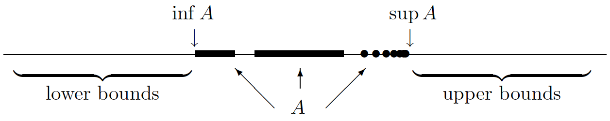
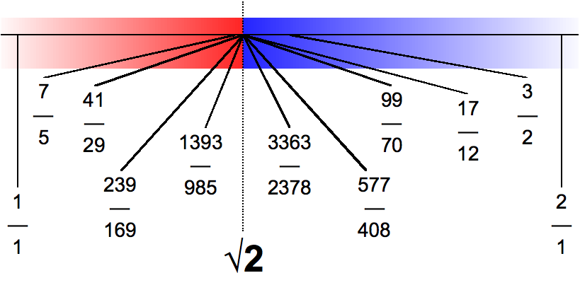
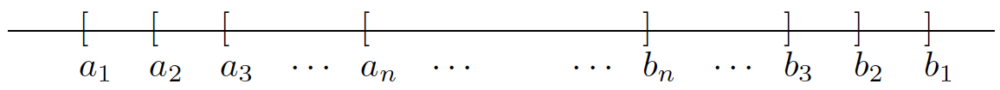

Topics:
- Abbott §1.2. Preliminaries
- Abbott §1.3. Axiom of completeness
- Abbott §1.4. Consequences of completeness

---

# Intro

## Some sets and their properties

| Set | Ordering ($\leq$ and $\geq$)? | Algebraic operations? |
|---|---|---|
| $\mathbb{N}$ | yes | $+, \times$ |
| $\mathbb{Z}$ | yes | $+, -, \times$ |
| $\mathbb{Q}$ | yes | $+, -, \times$, $\div$ |
| $\mathbb{R}$ | yes | $+, -, \times$, $\div$ |

What is the **difference** between $\mathbb{Q}$ and $\mathbb{R}$?

---

## Irrational numbers

*[Source: Wikipedia, CC0 1.0 Universal license]*

---

## The real line

*[Source: Wikipedia, public domain]*

$\mathbb{Q}$ has **gaps**: numbers like $\sqrt{2}$, $e$, and $\pi$ do not belong to $\mathbb{Q}$!

How to interpret $\mathbb{R}$ as a line?

---

# Axiom of completeness

## Upper bounds

**Definition:** $A \subseteq \mathbb{R}$ is called **bounded above** if
$$
\exists\, b \in \mathbb{R} \qquad\text{such that}\qquad a \leq b \qquad\forall\, a \in A
$$

**Example:**
$A = \displaystyle \bigg\{\frac{1}{n} \,:\, n \in \mathbb{N}\bigg\} = \bigg\{1,\frac{1}{2},\frac{1}{3},\dots\bigg\}$

Any number $b \geq 1$ is an **upper bound** for $A$

---

## Upper bounds

*[Source: Stephen Abbott, *Understanding Analysis*, Springer, 2015]*

**Definition:** $s\in\mathbb{R}$ is called the **least upper bound** of $A\subseteq\mathbb{R}$ if

- $s$ is an upper bound for $A$
- if $b$ is any upper bound for $A$ then $s \leq b$

**Notation:** $s = \sup A$ ("supremum")

---

## Upper bounds

**Example:** $A = \displaystyle \bigg\{\frac{1}{n} \,:\, n \in \mathbb{N}\bigg\} = \bigg\{1,\frac{1}{2},\frac{1}{3},\dots\bigg\}$

**Claim:** $\sup A = 1$

**Proof:**
- clearly, $1/n \leq 1$ for all $n \in \mathbb{N}$, so $1$ is an upper bound for $A$
- if $b$ is any upper bound for $A$, then $a \leq b$ for all $a \in A$
- in particular, for $a=1$ we have $1 \leq b$

---

## Upper bounds

**Lemma:** if $s$ is an upper bound for $A$ then
$$
s = \sup A
\quad\Leftrightarrow\quad
\forall\,\epsilon>0 \quad \exists \, a\in A\quad \text{s.t.} \quad s-\epsilon < a
$$

**Proof ($\Rightarrow$):** let $\epsilon>0$ be arbitrary

$$\begin{aligned}
s - \epsilon < s & \Rightarrow s-\epsilon \text{ is not an upper bound for } A \\[5mm]
                 & \Rightarrow \exists\, a\in A \quad\text{s.t.}\quad s-\epsilon < a
\end{aligned}$$

---

## Upper bounds

**Lemma:** if $s$ is an upper bound for $A$ then
$$
s = \sup A
\quad\Leftrightarrow\quad
\forall\,\epsilon>0 \quad \exists \, a\in A\quad \text{s.t.} \quad s-\epsilon < a
$$

**Proof ($\Leftarrow$):** let $b$ be **any** upper bound for $A$

- if $b < s$ then for $\epsilon = s - b$ there exists $a \in A$ such that $b = s - \epsilon < a$
- so $b$ is not an upper bound: contradiction!
- hence $s \leq b$, which implies that $s = \sup A$

---

## Upper bounds

**Example:** $A = \displaystyle \bigg\{\frac{1}{n} \,:\, n \in \mathbb{N}\bigg\}$

**Claim:** $\sup A = 1$

**Proof:**
- we know that $s = 1$ is an upper bound for $A$
- for all $\epsilon>0$ we have $s-\epsilon < 1$
- but $1 \in A$

---

## Lower bounds

**Definition:** $A \subseteq \mathbb{R}$ is called **bounded below** if
$$
\exists\,\ell \in \mathbb{R} \qquad\text{such that}\qquad \ell \leq a \qquad\forall\, a \in A
$$

**Example:**
$A = \displaystyle \bigg\{\frac{1}{n} \,:\, n \in \mathbb{N}\bigg\}$

Any number $\ell \leq 0$ is a **lower bound** for $A$

---

## Lower bounds

*[Source: Stephen Abbott, *Understanding Analysis*, Springer, 2015]*

**Definition:** $i\in\mathbb{R}$ is called the **greatest lower bound** of $A\subseteq\mathbb{R}$ if

- $i$ is a lower bound for $A$
- if $\ell$ is any lower bound for $A$ then $\ell \leq i$

**Notation:** $i = \inf A$ ("infimum")

---

## Lower bounds

**Lemma:** if $i$ is a lower bound for $A$ then
$$
i = \inf A
\quad\Leftrightarrow\quad
\forall\,\epsilon>0 \quad \exists \, a\in A\quad \text{s.t.} \quad a < i + \epsilon
$$

**Proof:** exercise 1.3.1

---

## Upper and lower bounds

**Warning:**
- a supremum is not always a maximum!
- an infimum is not always a minimum!

**Examples:**
$$
\begin{split}
\sup\bigg\{\frac{1}{2}, \frac{2}{3}, \frac{3}{4}, \frac{4}{5},\dots\bigg\} & = 1 \qquad\text{but there is **no largest element**!} \\[3mm]
\inf\bigg\{1, \frac{1}{2}, \frac{1}{3}, \frac{1}{4}, \dots\bigg\} & = 0 \qquad\text{but there is **no smallest element**!}
\end{split}
$$

---

## Do least upper bounds exist?

*[Source: Wikipedia, public domain]*

- Red: the set $A = \{x \in \mathbb{Q} \,:\, x^2 \leq 2\}$
- Blue: the upper bounds for $A$ that are in $\mathbb{Q}$

---

## The completeness of $\mathbb{R}$

**Axiom of Completeness (AoC):**

every nonempty subset of $\mathbb{R}$ that is bounded above
has a least upper bound

*An axiom is a starting point of reasoning and accepted as truth*

---

# Consequences of completeness

## The Archimedean property

**Theorem:**
1. $\forall\,x \in \mathbb{R} \quad\exists\,n \in \mathbb{N}\quad\text{s.t.}\quad n > x$
2. $\forall\,y>0 \quad\exists\,n \in \mathbb{N} \quad\text{s.t.}\quad 1/n < y$

**Proof (1):** if (1) is **NOT** true, then $\mathbb{N}$ is bounded above

AoC $\;\Rightarrow\;\alpha = \sup \mathbb{N}$ exists

$\alpha-1$ is **NOT** an upper bound for $\mathbb{N}$

There exists $n \in \mathbb{N}$ such that $\alpha -1 < n \;\Rightarrow\; \alpha < n+1$

$n+1 \in \mathbb{N} \;\Rightarrow\; \alpha$ is **NOT** an upper bound for $\mathbb{N}$. Contradiction!

---

## The Archimedean property

**Theorem:**
1. $\forall\,x \in \mathbb{R} \quad\exists\,n \in \mathbb{N}\quad\text{s.t.}\quad n > x$
2. $\forall\,y>0 \quad\exists\,n \in \mathbb{N} \quad\text{s.t.}\quad 1/n < y$

**Proof (2):** let $y>0$ be arbitrary and set $x = 1/y$

By (1) there exists $n \in \mathbb{N}$ such that $n > x$

Therefore $1/n < 1/x = y$

---

## The Archimedean property

**Claim:** $\inf\{1,\frac{1}{2},\frac{1}{3},\frac{1}{4},\dots\}=0$

**Proof:**
- Note that $0$ is a lower bound
- Archimedean Property: $\ell > 0 \;\Rightarrow\; \exists\,n \in \mathbb{N}$ s.t. $\displaystyle\frac{1}{n} < \ell$
- Therefore $\ell > 0$ is **NOT** a lower bound
- Conclusion: $0$ is the **greatest** lower bound

---

## Nested Interval Property

**Theorem:**
$$
[a_1, b_1] \supseteq [a_2, b_2] \supseteq [a_3, b_3] \supseteq \cdots
\quad\Rightarrow\quad
\bigcap_{n=1}^\infty [a_n, b_n] \neq \varnothing
$$

**Proof:** we have to show that
$$
\exists\,x \in \mathbb{R} \quad\text{ such that}\quad x\in [a_n,b_n] \;\;\forall\,n \in \mathbb{N}
$$

---

## Nested Interval Property

**Proof (ctd):** define $A = \{a_n \,:\, n\in\mathbb{N}\}$

*[Source: Stephen Abbott, *Understanding Analysis*, Springer, 2015]*

**Every** $b_n$ is an upper bound for $A$

AoC $\;\Rightarrow\; x := \sup A$ exists

$a_n \leq x \quad\forall\, n \in \mathbb{N}\quad$ (since $x = $ upper bound for $A$)

$x \leq b_n \quad\forall\, n \in \mathbb{N}\quad$ (since $x = $ **least** upper bound of $A$)

$x \in [a_n, b_n] \quad\forall\, n \in \mathbb{N}$

---

## Nested Interval Property

**Warning:** the NIP requires the intervals to be closed!

**Example:** if $I_n = (0, 1/n)$ then
$$
I_1 \supseteq I_2 \supseteq I_3 \supseteq \cdots
\qquad\text{but}\qquad
\bigcap_{n=1}^\infty I_n = \varnothing
$$

---

## Nested Interval Property

**Example (ctd):** for $I_n = (0,1/n)$ we have that $\bigcap_{n=1}^\infty I_n = \varnothing$

**Proof:**
$$\begin{aligned}
x \leq 0 & \Rightarrow x \notin I_n \text{ for all } n \in \mathbb{N} \\[5mm]
x > 0 & \Rightarrow \exists\, k \in \mathbb{N} \quad\text{s.t.}\quad \frac{1}{k} < x \qquad\text{(by AP)} \\[2mm]
& \Rightarrow \exists\, k \in \mathbb{N} \quad\text{s.t.}\quad x \notin I_k
\end{aligned}$$

In both cases $x \notin \bigcap_{n=1}^\infty I_n$

---

## The rational numbers are dense in $\mathbb{R}$

**Theorem:**
$$
\forall\,a, b \in \mathbb{R}\quad\text{with}\quad a < b\quad\exists\, r \in \mathbb{Q} \quad\text{s.t.}\quad a < r < b
$$

**Proof:** by AP there exists $n \in \mathbb{N}$ s.t.
$$
\frac{1}{n} < b-a \quad\Rightarrow\quad 1 < nb - na
$$

Hence, there exists $m \in \mathbb{Z}$ s.t.
$$
na < m < nb \quad\Rightarrow\quad a < \frac{m}{n} < b
$$

---

# Absolute value

## Absolute value

**Definition:** for any $x \in \mathbb{R}$ we set
$$
|x| =
\begin{cases}
\phantom{-}x & \text{if } x \geq 0 \\[5mm]
-x & \text{if } x < 0
\end{cases}
$$

**Examples:**
$$
|{-3.14}| = 3.14, \qquad
|0| = 0, \qquad
|2| = 2
$$

---

## Absolute value

**Lemma:** $|x| = \max\{x, -x\}$

**Proof:**
$$\begin{aligned}
x \geq 0 & \Rightarrow -x \leq 0 \Rightarrow -x \leq x \Rightarrow \max\{-x,x\} = x = |x| \\[5mm]
x < 0 & \Rightarrow -x > 0 \Rightarrow -x > x \Rightarrow \max\{-x,x\}=-x = |x|
\end{aligned}$$

---

## Algebraic properties

**Product rule:** $|xy| = |x|\,|y|$

**Proof:**

| | | | | |
|---|---|---|---|---|
| $x = 0$ or $y = 0$ | | | obvious | |
| $x > 0$ and $y > 0$ | $\Rightarrow$ | $xy > 0$ | $\Rightarrow$ | $|xy| = xy = |x|\,|y|$ |
| $x > 0$ and $y < 0$ | $\Rightarrow$ | $xy < 0$ | $\Rightarrow$ | $|xy| = x(-y) = |x|\,|y|$ |
| $x < 0$ and $y > 0$ | | similar | | |
| $x < 0$ and $y < 0$ | $\Rightarrow$ | $xy > 0$ | $\Rightarrow$ | $|xy| = (-x)(-y) = |x|\,|y|$ |

---

## Algebraic properties

**Quotient rule:** $\displaystyle\left|\frac{x}{y}\right| = \frac{|x|}{|y|} \qquad (y\neq 0)$

**Proof:** exercise

Hint: it is sufficient to show that $\displaystyle \left|\frac{1}{y}\right| = \frac{1}{|y|}$

---

## Inequalities

**Lemma:** if $x \in \mathbb{R}$ and $a \geq 0$, then

1. $|x| \leq a \;\Leftrightarrow\; -a \leq x \leq a$

2. $|x| \geq a \;\Leftrightarrow\; x \geq a \;\text{ or }\; x \leq -a$

**Proof:** exercise!

---

## Inequalities

**Triangle inequality:**
$$
|x + y| \leq |x| + |y|
\qquad\text{(**important!**)}
$$

**Proof:**
$$\begin{aligned}
x+y & \leq  |x| + y \;\;\leq\;\; |x| + |y| \\[5mm]
{-x}-y & \leq |x| - y \;\;\leq\;\; |x| + |y| \\[5mm]
|x+y| & = \max\{x+y, -x-y\} \;\;\leq\;\; |x| + |y|
\end{aligned}$$

---

## Inequalities

**Reverse triangle inequality:**
$$
\big||x| - |y|\big| \leq |x - y|
\qquad\text{(**important!**)}
$$

**Proof:**
$$\begin{aligned}
|x| = |x-y+y| & \leq |x-y| + |y| \\[4mm]
|x| - |y| & \leq |x-y| \\[4mm]
|y| - |x| & \leq |y-x| \;\; = \;\; |x-y| \qquad \text{(swap $x$ and $y$)} \\[4mm]
\big| |x| - |y|\big| & = \max\big\{|x| - |y|, |y| - |x|\big\} \;\;\leq\;\; |x-y|
\end{aligned}$$
