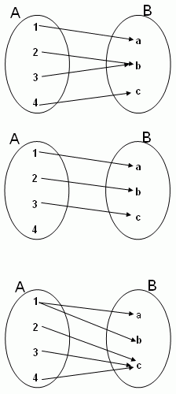

Topics:
- Abbott §1.5. Cardinality
- Abbott §1.6. Cantor's theorem

---

# Intro

## Counting without counting: 1--1 correspondence

---

## Counting without counting: 1--1 correspondence

---

## Functions (aka maps)

**Definition:** a function $f : A \to B$ is a rule that assigns to each $a \in A$ a single element $b = f(a) \in B$

- $A = $ **domain** of $f$
- $B = $ **co-domain** of $f$
- $f(A) = \{f(a) \,:\, a \in A\} = $ **range** of $f$

---

## Functions

A function / **NOT** a function / **NOT** a function

---

## Functions

**Definition:** $f : A \to B$ is called

- **injective (one-to-one)** if
$$
f(a) = f(b) \quad\Rightarrow\quad a = b
$$
- **surjective (onto)** if $B = f(A)$, i.e.
$$
\forall\,b \in B \quad\exists\, a \in A \quad\text{s.t.}\quad b = f(a)
$$
- **bijective** if $f$ is both injective and surjective

---

# Cardinality

## Cardinality

**Definition:** two sets $A$ and $B$ have the same **cardinality** if there exists a bijective function $f : A \to B$

**Notation:** $A \sim B$

**Moral:**
- the elements of $A$ and $B$ are in 1--1 correspondence
- $A$ and $B$ have "equally many" elements

---

## Cardinality

**Example:** $\mathbb{N} = \{1, 2, 3,\dots\} \sim \mathbb{E} = \{2, 4, 6, \dots\}$

A bijection is given by
$$
f : \mathbb{N} \to \mathbb{E}, \qquad f(n) = 2n
$$

**Moral:** there are "as many" even numbers as natural numbers!

---

## Cardinality

**Example:** $\mathbb{N}\sim\mathbb{Z}$

A bijection (exercise!) is given by
$$
f : \mathbb{N} \to \mathbb{Z}, \qquad
f(n) =
\begin{cases}
(n-1)/2 & \text{ if $n$ is odd} \\[5mm]
-n/2 & \text{ if $n$ is even}
\end{cases}
$$

**Moral:** there are "as many" integers as natural numbers!

---

## Cardinality

**Example:** to prove that $(-1,1) \sim \mathbb{R}$ consider
$$
f : (-1,1)\to\mathbb{R}, \qquad f(x) = \frac{x}{1-x^2}
$$

$f$ is **injective**: for all $a,b \in (-1,1)$ we have
$$\begin{aligned}
f(a) = f(b)
 & \Rightarrow  a(1-b^2) = b(1-a^2) \\[2mm]
 & \Rightarrow  a - b + a^2b-ab^2 = 0 \\[2mm]
 & \Rightarrow  (a - b)(ab+1) = 0 \\[2mm]
 & \Rightarrow  a=b
\end{aligned}$$

*[Note: $a,b \in (-1,1) \;\Rightarrow\; ab \in (-1,1)\;\Rightarrow\; ab+1 > 0$]*

---

## Cardinality

**Example:** to prove that $(-1,1) \sim \mathbb{R}$ consider
$$
f : (-1,1)\to\mathbb{R}, \qquad f(x) = \frac{x}{1-x^2}
$$

$f$ is **surjective**: for all $r \in \mathbb{R}$ we have
$$\begin{aligned}
f(x) = r
 & \Rightarrow  x = r(1-x^2) \\[2mm]
 & \Rightarrow  rx^2+x-r=0 \\[2mm]
 & \Rightarrow  x = \frac{-1 + \sqrt{1+4r^2}}{2r} \in (-1,1)
\end{aligned}$$

*[Note: the other solution does not lie in $(-1,1)$. What about the case $r=0$?]*

---

## Cardinality

**Theorem:** $\sim$ is an **equivalence relation**:
1. $A \sim A$
2. $A \sim B \;\Leftrightarrow\; B\sim A$
3. $A \sim B$ and $B\sim C \;\Rightarrow\; A\sim C$

**Proof:** exercise 1.5.5

---

## Cardinality

**Example:** to prove that $(a,b) \sim (-1,1)$ consider
$$
g : (a,b) \to (-1,1), \qquad g(x) = \frac{2x-a-b}{b-a}
$$

**Example:** to prove that $(a,b) \sim \mathbb{R}$ use that
$$
\left.
\begin{matrix}
(a,b) & \sim & (-1,1) \\[4mm]
(-1,1) & \sim & \mathbb{R}
\end{matrix}
\right\}
\quad\Rightarrow\quad
(a,b) \sim \mathbb{R}
$$

---

# Countable sets

## Countable sets

**Definition:** a set $A$ is called
- **countable** if $A\sim S$ for some $S \subseteq \mathbb{N}$
- **uncountable** otherwise

**Example:** $\mathbb{Z}$ is countable

*[Deviation from text book: Abbott requires $S = \mathbb{N}$]*

---

## Countable sets

**Theorem:** the following statements are equivalent:
1. $A$ is countable
2. there exists an injective map $g : A \to \mathbb{N}$
3. there exists a surjective map $h : \mathbb{N} \to A$

**Proof ($1 \Rightarrow 2$):** there exists $S \subseteq \mathbb{N}$ and a bijective map $f : A \to S$

The following map is still injective:
$$
g : A \to \mathbb{N}, \quad g(a) = f(a) \quad\forall\, a \in A
$$
*[By just enlarging the co-domain, we can only lose surjectivity]*

---

## Countable sets

**Theorem:** the following statements are equivalent:
1. $A$ is countable
2. there exists an injective map $g : A \to \mathbb{N}$
3. there exists a surjective map $h : \mathbb{N} \to A$

**Proof ($2 \Rightarrow 3$):** assume $g : A \to \mathbb{N}$ is injective

Fix any $a' \in A$ and define
$$
h : \mathbb{N} \to A, \quad
h(n) = \begin{cases} a & \text{if } g(a)=n \\ a' & \text{otherwise} \end{cases}
$$

Check that $h$ is surjective

---

## Countable sets

**Theorem:** the following statements are equivalent:
1. $A$ is countable
2. there exists an injective map $g : A \to \mathbb{N}$
3. there exists a surjective map $h : \mathbb{N} \to A$

**Proof ($3 \Rightarrow 1$):** assume $h : \mathbb{N} \to A$ is surjective

Check that the following map is injective:
$$
f : A \to \mathbb{N}, \quad f(a) = \min\{n \in \mathbb{N} \,:\, h(n) = a\}
$$

With $S := f(A) \subseteq \mathbb{N}$ the function $f : A \to S$ is surjective

---

## Countable sets

**Corollary:**
$$
\left.
\begin{matrix}
B \text{ countable} \\[1mm]
\exists\, g : A \to B \text{ injective}
\end{matrix}
\right\}
\quad\Rightarrow\quad
A \text{ countable}
$$

$$
\left.
\begin{matrix}
A \text{ countable} \\[1mm]
\exists\, h : A \to B \text{ surjective}
\end{matrix}
\right\}
\quad\Rightarrow\quad
B \text{ countable}
$$

**Proof:** exercise

---

## Countable sets

**Example:** $\mathbb{N} \times \mathbb{N} = \{(n,m) \,:\, n,m \in \mathbb{N}\}$ is countable since
$$
f : \mathbb{N} \times \mathbb{N} \to \mathbb{N}, \qquad f(n, m) = 2^n 3^m
$$
is injective

**Exercise:** find a *bijective* map $f : \mathbb{N} \times \mathbb{N} \to \mathbb{N}$
*[This is harder, but try it anyway!]*

---

## Countable sets

**Example:** $A, B$ countable $\;\Rightarrow\; A \cup B$ countable

Assume $f : A \to \mathbb{N}$ and $g : B \to \mathbb{N}$ injective and let

$$
h : A\cup B \to \mathbb{N}, \quad h(x) = \begin{cases} 2f(x) & \text{ if } x \in A \\[2mm] 2g(x)+1 & \text{ if } x \in B \setminus A \end{cases}
$$

Check that the map $h$ is injective

---

## Countable sets

**Theorem:** $A_n$ countable for all $n \in \mathbb{N}$ $\;\Rightarrow\; \displaystyle \bigcup_{n=1}^\infty A_n$ countable

**Proof:** exercise 1.5.3

**Example:**
$$
\begin{split}
A_n        & = \left\{0, \, \pm\frac{1}{n}, \, \pm\frac{2}{n}, \, \pm\frac{3}{n},\dots\right\} \text{ is countable (why?)} \\[5mm]
\mathbb{Q} & = \bigcup_{n=1}^\infty A_n \text{ is countable}
\end{split}
$$

---

# Uncountable sets

## Uncountable sets

**Theorem:** the interval $(0,1)$ is **uncountable**

**Proof (Cantor, 1891):** take **any** map $g : \mathbb{N} \to (0,1)$, then
$$
\begin{matrix}
g(1) & = & 0.d_{11}\,d_{12}\,d_{13}\,d_{14} \dots \\[2mm]
g(2) & = & 0.d_{21}\,d_{22}\,d_{23}\,d_{24} \dots \\[2mm]
g(3) & = & 0.d_{31}\,d_{32}\,d_{33}\,d_{34} \dots \\
     & \vdots &
\end{matrix}
$$

Define $t \in (0,1)$ by
$$
t = 0.c_1\,c_2\,c_3\,c_4\,\dots \quad c_n = \begin{cases} 2 & \text{ if } d_{nn} \neq 2 \\ 3 & \text{ if } d_{nn} = 2 \end{cases}
$$

Then $t \neq g(n)$ for all $n \in \mathbb{N}$ so $g$ is not surjective

---

## Uncountable sets

**Theorem:** $\mathbb{R}$ is uncountable

**Proof:** assume $\mathbb{R}$ is countable

If $g : \mathbb{N} \to \mathbb{R}$ is surjective, then
$$
\mathbb{R} = \{x_1, x_2, x_3, x_4, \dots \}
\quad\text{where}\quad
x_n = g(n)
$$

To show: $\quad\exists\, x\in\mathbb{R} \quad\text{s.t.}\quad x \neq x_n \quad \forall\,n\in\mathbb{N}$

---

## Uncountable sets

**Proof (ctd):** choose closed and bounded intervals as follows:
$$\begin{aligned}
I_1 & \text{ such that } x_1 \notin I_1 \\[4mm]
I_2 \subseteq I_1 & \text{ such that } x_2 \notin I_2 \\[4mm]
I_3 \subseteq I_2 & \text{ such that } x_3 \notin I_3 \\[4mm]
 & \vdots
\end{aligned}$$

NIP $\;\Rightarrow\; \exists \, x \in \mathbb{R} \quad\text{s.t.}\quad x \in \bigcap_{n=1}^\infty I_n$

But $x \neq x_n$ for all $n\in\mathbb{N}$ because $x_n \notin I_n$

---

## Uncountable sets

**Corollary:** $\mathbb{Q}^c = \mathbb{R}\setminus\mathbb{Q}$ is uncountable

We know that $\mathbb{Q}$ is countable

$\mathbb{Q}^c$ countable $\;\Rightarrow\;\mathbb{R} = \mathbb{Q} \cup \mathbb{Q}^c$ countable. Contradiction!

**Moral:** there are "more" irrationals than rationals!

---

## Cantor's theorem

Consider the finite set $\{1, 2, 3\}$. All possible subsets are given by:

| | | |
|---|---|---|
| $S_1 = \{\,\,\,\}$ | | |
| $S_2 = \{1\}$ | $S_3 = \{2\}$ | $S_4 = \{3\}$ |
| $S_5 = \{1,2\}$ | $S_6 = \{1,3\}$ | $S_7 = \{2,3\}$ |
| $S_8 = \{1,2,3\}$ | | |

In general: $\{1,2,3,\dots,n\}$ has $2^n$ subsets

---

## Cantor's theorem

**Definition:** let $A$ be a set, then the collection of all subsets
$$
\mathcal{P}(A) = \{S \,:\, S \subseteq A\}
$$
is called the power set of $A$

**Example:** for $A = \{1,2,3\}$ the power set $\mathcal{P}(A)$ has 8 elements

---

## Cantor's theorem

**Theorem:** there is no surjective function $f : A \to \mathcal{P}(A)$

**Proof:** take **any** map $f : A \to \mathcal{P}(A)$ and define
$$
B = \{x \in A \,:\, x \notin f(x)\}
$$

Assume that $B = f(x')$ for some $x' \in A$
- $x' \in B \quad\Rightarrow\quad x' \notin f(x') = B \quad\Rightarrow\quad$ Contradiction!
- $x' \notin B \quad\Rightarrow\quad x' \in f(x') = B \quad\Rightarrow\quad$ Contradiction!

Conclusion: $B$ is not in the range of $f$

---

## Cantor's theorem

| | | |
|---|---|---|
| $\mathcal{P}(\mathbb{N})$ | has "more" elements than | $\mathbb{N}$ |
| $\mathcal{P}(\mathcal{P}(\mathbb{N}))$ | has "more" elements than | $\mathcal{P}(\mathbb{N})$ |
| $\mathcal{P}(\mathcal{P}(\mathcal{P}(\mathbb{N})))$ | has "more" elements than | $\mathcal{P}(\mathcal{P}(\mathbb{N}))$ |
| | $\vdots$ | |

So there exist infinitely many cardinalities!
