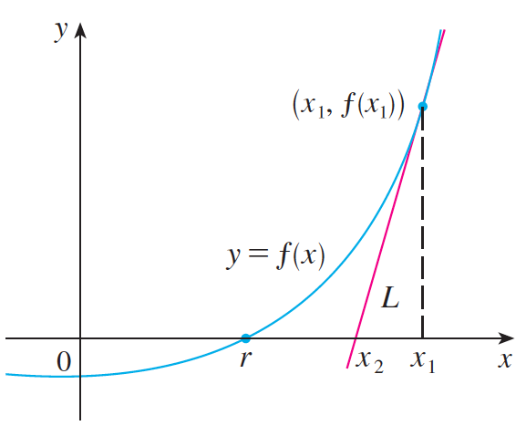
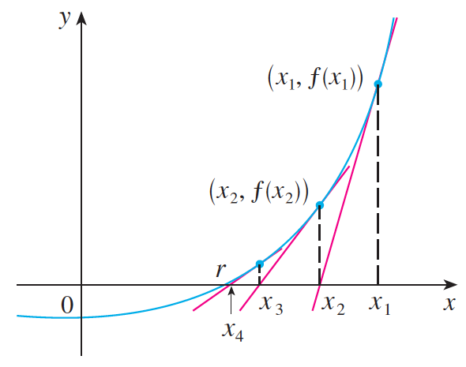
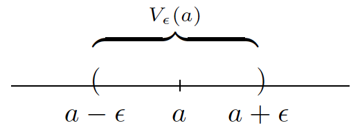
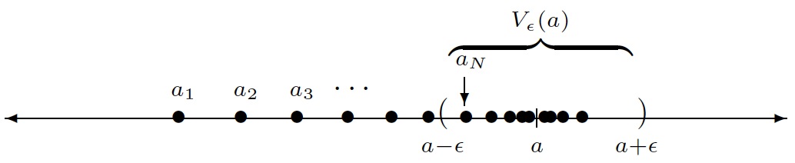

Topics:
- Abbott §2.2. The limit of a sequence
- Abbott §2.3. The algebraic and order limit theorems

---

# Motivation

## Newton's root finding method

*[Source: James Stewart, *Calculus Early Transcendentals*, 7th edition, Cengage, 2012]*

Equation of tangent line: $y = f'(x_1)(x - x_1) + f(x_1)$

Root of tangent line: $\displaystyle x_2 := x_1 - \frac{f(x_1)}{f'(x_1)}$

---

## Newton's root finding method

*[Source: James Stewart, *Calculus Early Transcendentals*, 7th edition, Cengage, 2012]*

Iterative process: $\displaystyle x_{n+1} := x_n - \frac{f(x_n)}{f'(x_n)} \qquad n=1,2,3,\dots$

---

# Sequences and limits

## Sequences

**Definition:** a **sequence** is a function with domain $\mathbb{N}$

Sequences can be written as infinite lists of numbers:
- $(1, \tfrac{1}{2}, \tfrac{1}{3}, \tfrac{1}{4}, \dots)$
- $(\frac{n+1}{n})_{n=1}^\infty = (\tfrac{2}{1}, \tfrac{3}{2}, \tfrac{4}{3}, \dots)$
- $(x_n)$ where $x_1 = 2$ and $x_{n+1} = \tfrac{1}{2}(x_n + 1)$

---

## Limits

**Definition:** $(a_n)$ **converges** to $a$ if

$$
\forall\,\epsilon>0 \quad\exists\,N \in \mathbb{N} \quad\text{s.t.}\quad
n \geq N \quad\Rightarrow\quad |a_n - a| < \epsilon
$$

**Notation:** $a = \displaystyle\lim_{n\to\infty} a_n \quad\text{or}\quad a = \lim a_n \quad\text{or}\quad a_n \rightarrow a$

**Meaning:** $a_n$ gets arbitrarily close to $a$ as $n$ grows larger

---

## Limits

**Definition:** for $a \in \mathbb{R}$ and $\epsilon>0$ the set

$$
V_\epsilon(a) = \{x \in \mathbb{R} \,:\, |x-a|<\epsilon\} = (a-\epsilon, a+\epsilon)
$$

is called the **$\epsilon$-neighborhood** of $a$

*[Source: Stephen Abbott, *Understanding Analysis*, Springer, 2015]*

---

## Limits

**Alternative definition:** $(a_n)$ **converges** to $a$ if

$$
\forall\,\epsilon>0 \quad\exists\,N \in \mathbb{N} \quad\text{s.t.}\quad
n \geq N \quad\Rightarrow\quad a_n \in V_\epsilon(a)
$$

*[Source: Stephen Abbott, *Understanding Analysis*, Springer, 2015]*

**Moral:** the tail of the sequence gets trapped in $V_\epsilon(a)$

---

## Limits

**Example:** $\lim \displaystyle\frac{1}{n} = 0$

Let $\epsilon > 0$ be arbitrary

Archimedean property $\;\Rightarrow\; \exists\,N \in \mathbb{N} \quad\text{s.t.}\quad \displaystyle\frac{1}{N} < \epsilon$

This choice of $N$ gives

$$
n \geq N
\qquad\Rightarrow\qquad
\frac{1}{n} \leq \frac{1}{N} < \epsilon
\qquad\Rightarrow\qquad
\left|\frac{1}{n} - 0\right| = \frac{1}{n} < \epsilon
$$

---

## Limits

**Example:** $\lim \displaystyle\left(\frac{6n+7}{3n+1}\right) = 2$

Note:

$$
\left|\frac{6n+7}{3n+1}-2\right|
=
\left|\frac{6n+7}{3n+1}-\frac{6n+2}{3n+1}\right|
=
\frac{5}{3n+1}
< \frac{5}{3n}
$$

---

## Limits

**Example:** $\lim \displaystyle\left(\frac{6n+7}{3n+1}\right) = 2$

Let $\epsilon > 0$ be arbitrary

Choose $N\in\mathbb{N}$ such that $\displaystyle\frac{1}{N} < \frac{3}{5}\epsilon$

This choice of $N$ gives

$$
n \geq N
\quad\Rightarrow\quad
\left|\frac{6n+7}{3n+1}-2\right| < \frac{5}{3n} \leq \frac{5}{3N} < \epsilon
$$

---

## Standard limits

- $\lim 1/n^\alpha = 0 \qquad (\alpha > 0)$
- $\lim c^n = 0 \quad\qquad (-1 < c < 1)$
- $\lim c^n n^\alpha = 0 \qquad (-1 < c < 1, \; \alpha\in\mathbb{R})$
- $\lim \sqrt[n]{c} = 1 \;\;\,\qquad (c>0)$
- $\lim \sqrt[n]{n} = 1$
- $\lim n! / n^n = 0$

*[For a proof, see document "Course information" on Brightspace]*

---

## Divergent sequences

**Definition:** a sequence that does not converge is called **divergent**

**Example:** $(a_n) = (-1, 1, -1, 1, \dots)$ is divergent

*[But how to prove this?]*

---

## Divergent sequences

**Definition of convergence:**

$$
\forall\,\epsilon>0 \quad \exists\, N \in \mathbb{N} \quad\text{s.t.}\quad
n \geq N \quad\Rightarrow\quad |a_n - a| < \epsilon
$$

**Logical negation:**

$$
\exists\,\epsilon>0 \quad\text{s.t.}\quad
\forall\,N\in \mathbb{N}\quad\exists\, n \geq N \quad\text{s.t.}\quad |a_n-a| \geq \epsilon
$$

---

## Divergent sequences

**Example:** $(a_n) = (-1,1,-1,1,\dots)$ diverges

*[no number $a\in\mathbb{R}$ can be a limit]*

Choose $\epsilon = 1$ and $N\in\mathbb{N}$ arbitrary

Case $a \geq 0$:

$n=2N+1 \;\Rightarrow\; |a_n - a| = |{-1}-a| = 1 + a \geq \epsilon$

Case $a < 0$:

$n=2N \;\Rightarrow\; |a_n - a| = |1-a| = 1 - a > \epsilon$

---

## Bounded sequences

**Definition:** $(a_n)$ is **bounded** if

$$
\exists\, M > 0 \quad\text{s.t.}\quad |a_n| \leq M \quad\forall\, n \in \mathbb{N}
$$

**Examples:**

$(a_n) = (1,\tfrac{1}{2},\tfrac{1}{3},\dots)$ is bounded (take $M=1$)

$(b_n) = (1,4,9,16,25,\dots)$ is **NOT** bounded

---

## Bounded sequences

**Theorem:** $(a_n)$ is convergent $\;\Rightarrow\; (a_n)$ is bounded

**Proof:** let $a=\lim a_n$ then for $\epsilon = 1$ there exists $N \in \mathbb{N}$ such that

$$\begin{aligned}
n \geq N
& \quad\Rightarrow\quad
|a_n-a| < 1 \\[2mm]
& \quad\Rightarrow\quad
\big||a_n|-|a|\big| < 1 \\[2mm]
& \quad\Rightarrow\quad
|a_n|-|a| < 1 \\[2mm]
& \quad\Rightarrow\quad
|a_n| < 1 + |a|
\end{aligned}$$

For $M = \max\{|a_1|,|a_2|,\dots,|a_{N-1}|,1+|a|\}$ we have

$$
|a_n| \leq M \quad \forall\, n\in \mathbb{N}
$$

---

## Bounded sequences

**Theorem:** $(a_n)$ is convergent $\;\Rightarrow\; (a_n)$ is bounded

**Warning:** the converse is not true!

$(a_n) = (-1, 1, -1, 1, \dots)$ is bounded but **NOT** convergent

---

## Bounded sequences

**Theorem:** $(a_n)$ is convergent $\;\Rightarrow\; (a_n)$ is bounded

**Note:** theorem can be used to prove that a sequence diverges

**Example:** $(a_n) = (n^2)$ diverges because it is not bounded

---

# Properties of limits

## Algebraic properties

**Theorem:** if $a = \lim a_n$ and $b = \lim b_n$ then

1. $\lim (ca_n) = ca \qquad (\text{where } c \in \mathbb{R})$
2. $\lim (a_n + b_n) = a+b$
3. $\lim (a_nb_n) = ab$
4. $\lim (a_n/b_n) = a/b \qquad\qquad (\text{if } b\neq 0)$

**Proof:** for (1) and (4) see text book

---

## Algebraic properties

**Proof of (2):**

$$
\begin{split}
|(a_n+b_n) - (a+b)| & = |(a_n-a) + (b_n-b)| \\[2mm]
 & \leq |a_n-a| + |b_n-b|
\end{split}
$$

Let $\epsilon>0$ be arbitrary, then

$$
\begin{split}
\exists\,N_1 \in \mathbb{N} \quad\text{s.t.} \quad n\geq N_1 & \quad\Rightarrow\quad |a_n-a| < \tfrac{1}{2}\epsilon \\[3mm]
\exists\,N_2 \in \mathbb{N} \quad\text{s.t.} \quad n\geq N_2 & \quad\Rightarrow\quad |b_n-b| < \tfrac{1}{2}\epsilon
\end{split}
$$

Define $N = \max\{N_1,N_2\}$ then

$$
n \geq N \quad\Rightarrow\quad |(a_n+b_n) - (a+b)| < \tfrac{1}{2}\epsilon + \tfrac{1}{2}\epsilon = \epsilon
$$

---

## Algebraic properties

**Proof of (3):**

$$\begin{aligned}
|a_nb_n - ab| & =    |a_nb_n - ab_n + ab_n - ab| \\[5mm]
              & =    |b_n(a_n-a) + a(b_n-b)| \\[5mm]
              & \leq |b_n(a_n-a)| + |a(b_n-b)| \\[5mm]
              & =    |b_n|\,|a_n-a| + |a|\,|b_n-b| \\[5mm]
              & \leq M |a_n-a| + |a|\,|b_n-b|
\end{aligned}$$

Recall: $(b_n)$ is convergent and therefore bounded!

---

## Algebraic properties

**Proof of (3):**

$$
|a_nb_n - ab| \leq M |a_n-a| + |a||b_n-b|
$$

Let $\epsilon>0$ be arbitrary, then

$$
\begin{split}
\exists\, N_1 \in \mathbb{N} \quad\text{s.t.}\quad n\geq N_1 & \quad\Rightarrow\quad |a_n-a| < \frac{\epsilon}{2M} \\[2mm]
\exists\, N_2 \in \mathbb{N} \quad\text{s.t.}\quad n\geq N_2 & \quad\Rightarrow\quad |b_n-b| < \frac{\epsilon}{2|a|}
\end{split}
$$

Define $N = \max\{N_1,N_2\}$ then

$$
n \geq N \quad\Rightarrow\quad |a_nb_n - ab| < \epsilon
$$

---

## Order properties

**Theorem:** if $\lim a_n = a$ and $\lim b_n = b$ then

1. $a_n \geq 0 \;\,\quad\forall n \in \mathbb{N} \quad\Rightarrow\quad a \geq 0$
2. $a_n \leq b_n \quad\forall n \in \mathbb{N} \quad\Rightarrow\quad a \leq b$
3. $c \leq b_n \;\,\quad\forall n \in \mathbb{N} \quad\Rightarrow\quad c \leq b$
4. $a_n \leq c \;\,\quad\forall n \in \mathbb{N} \quad\Rightarrow\quad a \leq c$

**Moral:** limits preserve (nonstrict!) inequalities

---

## Order properties

**Proof (1):** assume that $a < 0$

For $\epsilon = |a|$ there exists $N \in \mathbb{N}$ such that

$$\begin{aligned}
n \geq N & \quad\Rightarrow\quad  |a_n - a| < \epsilon \\[5mm]
         & \quad\Rightarrow\quad  {-\epsilon} < a_n - a < \epsilon \\[5mm]
         & \quad\Rightarrow\quad  a-\epsilon < a_n < a+\epsilon \\[5mm]
         & \quad\Rightarrow\quad  a_n < a+|a|=0 \\[3mm]
         &                        \text{Contradiction!}
\end{aligned}$$

---

## Order properties

**Proof (2):** if $a_n \leq b_n$ then $b_n-a_n\geq 0$ so that

$$
b-a = \lim(b_n - a_n) \geq 0 \quad\Rightarrow\quad b \geq a
$$

**Proof (3):** apply part (2) with $a_n = c$

**Proof (4):** apply part (2) with $b_n = c$

---

## Order properties

**Warning:** strict inequalities are not always preserved!

**Example:** $\displaystyle\frac{1}{n} > 0$ for all $n \in \mathbb{N}$ but $\displaystyle\lim\frac{1}{n}=0$

**Example:** $\displaystyle\frac{n}{n+1} < 1$ for all $n \in \mathbb{N}$ but $\displaystyle\lim\frac{n}{n+1}=1$
