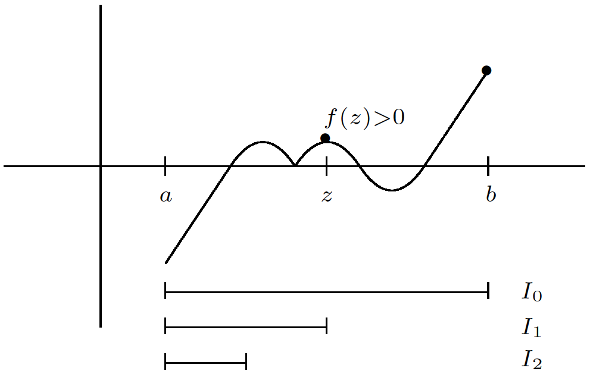

Topics:
- Abbott §4.4. Continuity and compactness
- Abbott §4.5. The intermediate value theorem

---

# Continuity and compactness

## Compact sets

**Definition:** $K\subseteq\mathbb{R}$ is **compact** if

every sequence in $K$ has a convergent subseq. with a limit in $K$

**Equivalent:**

1. $K$ is closed and bounded
2. Any open cover for $K$ has a finite subcover

---

## Images of compact sets

**Theorem:** $f : A \to \mathbb{R}$ cont. and $K\subseteq A$ compact $\Rightarrow f(K)$ compact

**Proof:**

Let $(y_n)\subseteq f(K)$ be arbitrary

There exists $(x_n)\subseteq K$ such that $y_n=f(x_n)$ for all $n$

$K$ compact $\;\Rightarrow\;$ some subsequence $x_{n_k}\to x \in K$

$f$ continuous $\;\Rightarrow\;$ $y_{n_k} = f(x_{n_k}) \to f(x) \in f(K)$

---

## Images of compact sets

**Warning:** the previous theorem is **FALSE** for pre-images:
$$
f^{-1}(K) = \{x\in A \,:\, f(x) \in K\}
$$

Counter example:
- $f(x) = 0$ for all $x \in \mathbb{R}$
- $K = \{0\}$ is compact
- $f^{-1}(K) = \mathbb{R}$ is **NOT** compact

---

## Maxima and minima

**Theorem:** let $K\subseteq\mathbb{R}$ be compact and $f : K \to \mathbb{R}$ continuous

then $f$ attains a maximum and a minimum on $K$

**Proof (max):**

$f(K)$ is compact

Exercise 3.3.1 $\;\Rightarrow\; s = \sup f(K)$ exists and $s \in f(K)$

$s = f(c)$ for some $c \in K$

$s$ is an upper bound for $f(K) \;\Rightarrow\; f(x) \leq s$ for all $x \in K$

---

## Maxima and minima

**Warning:** without compactness the previous theorem is false!

Counter example: $f(x) = x$ has
- no minimum on $(0,1]$
- no maximum on $[0,1)$
- neither a maximum nor a minimum on $\mathbb{R}$

---

# Uniform continuity

## Uniform continuity

**Definition:** $f : A \to \mathbb{R}$ is **uniformly continuous** on $A$ if

$\forall\,\epsilon>0 \quad \exists\,\delta>0$ such that $\forall\,x,y \in A$
$$
|x-y| < \delta \quad\Rightarrow\quad |f(x)-f(y)|<\epsilon
$$

**Note:** uniform means that **$\delta$ does not depend on $x$ or $y$**
*[but $\delta$ may still depend on $\epsilon$]*

---

## Uniform continuity

**Example:** $f(x)=ax+b$ is uniformly continuous on $\mathbb{R}$

For $x,y \in \mathbb{R}$ we have
$$\begin{aligned}
|f(x)-f(y)|
& = |(ax+b)-(ay+b)| \\[5mm]
& = |a|\,|x-y|
\end{aligned}$$

Let $\epsilon>0$ and pick $\delta = \epsilon / |a|$, then for all $x, y \in \mathbb{R}$ we have
$$
|x-y| < \delta
\quad\Rightarrow\quad
|f(x) - f(y)| < |a|\delta = \epsilon
$$

*[What if $a=0$?]*

---

## Uniform continuity

**Example:** $f(x)=x^2$ is uniformly continuous on $[a,b]$

For $x,y \in [a,b]$ we have
$$\begin{aligned}
|f(x)-f(y)|
& = |x+y|\,|x-y| \\[3mm]
& \leq (|x| + |y|)\,|x-y| \\[3mm]
& \leq 2M|x-y| \quad\qquad M := \max\{|a|,|b|\}
\end{aligned}$$

For $\epsilon>0$ take $\delta = \epsilon / 2M$, then for all $x,y \in [a,b]$ we have
$$
|x-y| < \delta
\quad\Rightarrow\quad
|f(x)-f(y)| < 2M \delta = \epsilon
$$

---

## Uniform continuity

**Definition:** $f : A \to \mathbb{R}$ is **uniformly continuous** on $A$ if

$\forall\,\epsilon>0 \quad \exists\,\delta>0$ such that $\forall\,x,y \in A$
$$
|x-y| < \delta \quad\Rightarrow\quad |f(x)-f(y)|<\epsilon
$$

**Logical negation:** $\exists\,\epsilon_0 > 0$ such that

$\forall\,\delta>0 \quad \exists\,x,y \in A$ for which
$$
|x-y| < \delta
\qquad\text{but}\qquad
|f(x)-f(y)| \geq \epsilon_0
$$

---

## Uniform continuity

**Example:** $f(x)=x^2$ is **NOT** uniformly continuous on $\mathbb{R}$

For any $\delta>0$ we have
$$
x = \frac{1}{\delta} + \frac{\delta}{2}, \qquad
y = \frac{1}{\delta}
\qquad\Rightarrow\qquad
|x-y| = \frac{\delta}{2} < \delta
$$
but
$$
|x^2 - y^2| = 1+\frac{\delta^2}{4} > 1
$$

So the definition does not hold for $\epsilon = 1$

---

## Uniform continuity

**Theorem:** the following statements are equivalent

1. $f : A \to \mathbb{R}$ is **NOT** uniformly continuous on $A$
2. There exists $\epsilon_0>0$ and $(x_n),(y_n)\subseteq A$ such that
   $$
   |x_n-y_n| \to 0
   \qquad\text{but}\qquad
   |f(x_n)-f(y_n)| \geq \epsilon_0 \quad\text{for all } n
   $$

**Proof:** see book

---

## Uniform continuity

**Example:** $f(x)=x^2$ is **NOT** uniformly continuous on $\mathbb{R}$

$\displaystyle x_n = n+\frac{1}{n}$

$y_n = n$

$\displaystyle |x_n-y_n| = \frac{1}{n} \to 0$

$\displaystyle |f(x_n)-f(y_n)| = 2+\frac{1}{n^2} > 2 \quad \forall\,n\in\mathbb{N}$

---

## Uniform continuity

**Example:** $f(x)=\displaystyle\frac{1}{x}$ is unif. cont. on $[a,\infty)$ for all $a>0$

For $x,y \in [a,\infty)$ we have
$$
\left|\frac{1}{x}-\frac{1}{y}\right|
=
\left|\frac{y-x}{xy}\right|
=
\frac{|x-y|}{xy}
\leq
\frac{|x-y|}{a^2}
$$

For $\epsilon>0$ take $\delta = a^2\epsilon$, then for all $x,y \in [a,\infty)$ we have
$$
|x-y| < \delta
\quad\Rightarrow\quad
|f(x)-f(y)| < \frac{\delta}{a^2} = \epsilon
$$

---

## Uniform continuity

**Example:** $f(x)=\displaystyle\frac{1}{x}$ is **NOT** unif. cont. on $(0,\infty)$

$x_n = \displaystyle\frac{1}{n+1}$

$y_n = \displaystyle\frac{1}{n}$

$\displaystyle |x_n-y_n| \to 0$

$\displaystyle |f(x_n)-f(y_n)| = 1 \quad\forall\,n \in \mathbb{N}$

*[Hence, uniform continuity also depends on the domain!]*

---

## Uniform continuity

**Example:** $\sqrt{x}$ is uniformly continuous on $[1,\infty)$

For $x,y\geq 1$ we have
$$
\left|\sqrt{x}-\sqrt{y}\right|
=
\left|\frac{x-y}{\sqrt{x}+\sqrt{y}}\right|
=
\frac{|x-y|}{\sqrt{x}+\sqrt{y}}
\leq
\frac{|x-y|}{2}
$$

For given $\epsilon>0$ take $\delta=2\epsilon$ to satisfy the definition

---

## Uniform continuity

**Theorem:** if $f : K \to \mathbb{R}$ is continuous and $K$ is compact then
$f$ is uniformly continuous on $K$

**Proof:** let $\epsilon>0$ be arbitrary

For all $c \in K$ there exists $\delta_c>0$ such that
$$
|x-c| < 2\delta_c
\quad\Rightarrow\quad
|f(x)-f(c)| < \tfrac{1}{2}\epsilon
$$

$O_c = (c-\delta_c, c+\delta_c)$, with $c \in K$, form an open cover for $K$

$K \subseteq O_{c_1} \cup \dots \cup O_{c_n}$ for some $c_1,\dots,c_n \in K$

Take $x,y \in K$ with $|x-y| < \delta = \min\{\delta_{c_1},\dots,\delta_{c_n}\}$

---

## Uniform continuity

**Proof (ctd):**
$$\begin{aligned}
|x-c_i| & < \delta_{c_i} \quad \text{for some } i=1,\dots,n \\[2mm]
|f(x)-f(c_i)| & < \tfrac{1}{2}\epsilon \\[8mm]
|c_i-y| & \leq |c_i-x| + |x-y| \;\; < \;\; \delta_{c_i} + \delta \;\; \leq \;\; 2\delta_{c_i} \\[2mm]
|f(c_i)-f(y)| & < \tfrac{1}{2}\epsilon
\end{aligned}$$

Apply triangle inequality with (1) and (2) $\;\Rightarrow\; |f(x)-f(y)| < \epsilon$

---

## Uniform continuity

**Example:**
$$
\left.
\begin{matrix*}[l]
[0,1] \text{ is compact} \\[3mm]
f(x) = \sqrt{x} \text{ continuous on } [0,1]
\end{matrix*}
\right\}
\quad\Rightarrow\quad
f \text{ is unif. cont. on } [0,1]
$$

**Exercise:** show that $f(x)=\sqrt{x}$ is uniformly continuous on $[0, \infty)$

---

# Intermediate value theorem

## Intermediate value theorem

**Theorem:** if $f : [a,b]\to\mathbb{R}$ is continuous and
$$
f(a) < L < f(b)
\qquad\text{or}\qquad
f(a) > L  > f(b)
$$
then $f(c)=L$ for some $c\in (a,b)$

**Proof:** without loss of generality we can assume
- $L=0$, otherwise replace $f(x)$ by $f(x)-L$
- $f(a) < 0 < f(b)$, otherwise replace $f(x)$ by $-f(x)$

---

## Intermediate value theorem

**Proof (ctd):** the bisection method gives nested intervals $I_n$:

*[Source: Stephen Abbott, *Understanding Analysis*, Springer, 2015]*

At the left endpoint of each $I_n$ we have $f < 0$

At the right endpoint of each $I_n$ we have $f \geq 0$

---

## Intermediate value theorem

**Proof (ctd):** there exist intervals $I_n = [a_n, b_n]$ such that
- $f(a_n) < 0$ and $f(b_n) \geq 0$
- $I_0 \supseteq I_1 \supseteq I_2 \supseteq \cdots$
- $\text{length}(I_n) = (b-a) / 2^n$

NIP $\;\Rightarrow\; \exists\,c\in [a,b]$ such that $c \in I_n = [a_n,b_n] \quad \forall\,n \in \mathbb{N}$

Note that
$$
|a_n - c| \leq \text{length}(I_n) \to 0
\quad\text{and}\quad
|b_n - c| \leq \text{length}(I_n) \to 0
$$

---

## Intermediate value theorem

**Proof (ctd):** we have
$$
c = \lim a_n = \lim b_n
$$

The continuity of $f$ implies
$$
f(c) = \lim f(a_n) = \lim f(b_n)
$$

The Order Limit Theorem gives:
$$
\left.
\begin{matrix*}[l]
f(a_n) < 0    \quad \forall\,n \in \mathbb{N} \quad\Rightarrow\quad f(c) \leq 0 \\[4mm]
f(b_n) \geq 0 \quad \forall\,n \in \mathbb{N} \quad\Rightarrow\quad f(c) \geq 0
\end{matrix*}
\right\}
\quad\Rightarrow\quad
f(c) = 0
$$

---

## Intermediate value theorem

**Example:** $p(x) = x^5 - 2x^3 - 2$ has a zero on $(0,2)$

$p$ is continuous on $[0,2]$ (why?)

$p(0) = -2<0$ and $p(2) = 14>0$

IVT $\;\Rightarrow\; p(c) = 0$ for some $c \in (0,2)$

---

## Intermediate value theorem

**Example:** if $f : [a,b] \to \mathbb{R}$ is continuous and $f([a,b])\subseteq [a,b]$
then $f(c) = c$ for some $c \in [a,b]$

Assume $f(a)\neq a$ and $f(b) \neq b$ (otherwise nothing to prove)

$f([a,b])\subseteq [a,b] \;\Rightarrow\; f(a) > a, \; f(b) < b$

$g(x) = f(x) - x$ is continuous and $g(b) < 0 < g(a)$

IVT $\;\Rightarrow\; g(c) = 0$ for some $c \in (a,b)$
