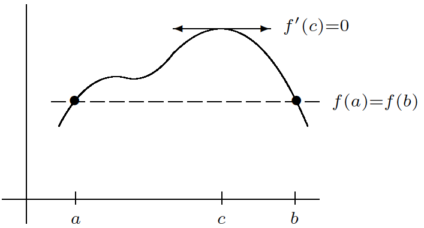
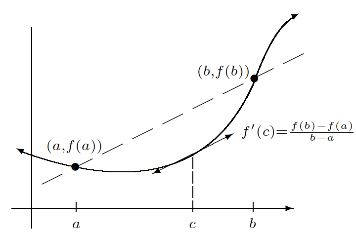

Topics:
- Abbott §5.2: Derivatives
- Abbott §5.3: Mean value theorem
- Abbott §5.4: A continuous, nowhere differentiable function

---

# Derivatives

## Derivative = limit of a difference quotient

**Definition:** let $I\subseteq\mathbb{R}$ be an interval and $f : I \to \mathbb{R}$

$f$ is called **differentiable** at $c \in I$ if

$$
f'(c) := \lim_{x\to c} \frac{f(x)-f(c)}{x-c} \quad\text{exists}
$$

---

## Differentiability versus continuity

**Theorem:** $f : I \to \mathbb{R}$ differentiable at $c\in I \;\Rightarrow\; f$ continuous at $c$

**Proof:**
$$\begin{aligned}
\lim_{x\to c} \big[f(x)-f(c)\big]
 & = \lim_{x\to c} \frac{f(x)-f(c)}{x-c} \cdot (x-c) \\[4mm]
 & = \lim_{x\to c} \frac{f(x)-f(c)}{x-c} \cdot \lim_{x\to c} \big[x-c\big] \\[4mm]
 & = f'(c)\cdot 0 \\[4mm]
 & = 0
\end{aligned}$$

---

## Differentiability versus continuity

**Example:** $f(x) = \begin{cases} 1 & \text{if } x > 0 \\[3mm] 0 & \text{if } x \leq 0 \end{cases}$
is **NOT** differentiable at $c=0$

Reason: $f$ is **NOT** continuous at $c=0$

---

## Differentiability versus continuity

**Example:** $f(x) = |x|$ continuous but **NOT** differentiable at $c=0$

$$
\lim_{x\to 0} \frac{f(x)-f(0)}{x-0} = \lim_{x\to 0} \frac{|x|}{x}\qquad\text{does \textbf{NOT} exist}
$$

**Exercise:** show $f$ is differentiable at every $c\neq 0$ and
$$
f'(c) = \begin{cases} \phantom{-}1 & \text{ if } c > 0 \\ -1 & \text{ if } c < 0 \end{cases}
$$

---

## When to use the definition?

**Example:** $f(x) = \displaystyle\frac{x}{1+|x|} \;\Rightarrow\; f'(0) = 1$

Apply the definition:

$$\begin{aligned}
\left|\frac{f(x)-f(0)}{x-0} - 1\right|
& = \left|\frac{1}{1+|x|} - 1\right|
= \frac{|x|}{1+|x|}
\leq |x| \\[8mm]
f'(0) & = \lim_{x\to 0} \frac{f(x)-f(0)}{x-0} = 1 \quad\text{by $\epsilon,\delta$-argument}
\end{aligned}$$

**Remark:** for $c \neq 0$ we can compute $f'(c)$ using calculus rules

---

# Darboux's theorem

## Interior extremum theorem

**Theorem:** assume

- $f : (a,b)\to\mathbb{R}$ is differentiable
- $f$ attains a maximum or minimum at $c \in (a,b)$

Then $f'(c) = 0$

---

## Interior extremum theorem

**Proof (maximum):** $f(c) \geq f(x)$ for all $x \in (a,b)$

Take sequences $(x_n)$ and $(y_n)$ in $(a,b)$ such that
$$
x_n < c < y_n \quad\forall\,n\in\mathbb{N} \quad\text{ and }\quad \lim x_n = \lim y_n = c
$$

$f'(c)=0$ by the order limit theorem:
$$\begin{aligned}
f'(c) & = \lim \frac{f(x_n)-f(c)}{x_n-c} \;\; \geq 0 \\[4mm]
f'(c) & = \lim \frac{f(y_n)-f(c)}{y_n-c} \;\; \leq 0
\end{aligned}$$

---

## Interior extremum theorem

**Warning:** previous theorem **need not be true** for closed intervals!

Counter-example: $f(x) = x$ on $[0,1]$
- minimum at $x=0$ but $f'(0) = 1$
- maximum at $x=1$ but $f'(1) = 1$

---

## Darboux's theorem

**Theorem:** if $f : [a,b] \to \mathbb{R}$ is differentiable and
$$
f'(a) < L < f'(b)
\qquad\text{or}\qquad
f'(a) > L > f'(b)
$$
then there exists $c \in (a,b)$ with $f'(c)=L$

**Notes:**
- proof $\neq$ intermediate value theorem applied to $f'$!
- we do **NOT** assume $f'$ to be continuous!

**Proof:** restrict to the case $f'(a) < 0 < f'(b)$

Otherwise replace $f(x)$ by $\pm(f(x) - Lx)$

---

## Darboux's theorem

**Proof (ctd):** let $f'(a) < 0 < f'(b)$

Claim: $\exists\,s \in (a,b)$ s.t. $f(s) < f(a)$

Otherwise $f(x) \geq f(a) \quad\forall\,x\in (a,b)\quad$ so that
$$f'(a) = \lim_{x\to a} \frac{f(x)-f(a)}{x-a} \geq 0 \qquad\text{Contradiction!}
$$

Similarly: $\exists\,t \in (a,b)$ s.t. $f(t) < f(b)$

---

## Darboux's theorem

**Proof (ctd):**

$[a,b]$ compact and $f$ continuous $\;\Rightarrow\; f$ attains a minimum on $[a,b]$

$f(s) < f(a)$ and $f(t)<f(b) \;\Rightarrow\; f$ attains a minimum in $(a,b)$

Interior extremum theorem $\;\Rightarrow\; f'(c)=0$ for some $c\in(a,b)$

---

## Darboux's theorem

**Example:**
$f(x) = \begin{cases} 1 & \text{if } x \in \mathbb{Q} \\[3mm] 0 & \text{if } x \notin\mathbb{Q} \end{cases}$
is **NOT** a derivative

Assume there exists $F : \mathbb{R} \to \mathbb{R}$ such that $F'(x)=f(x)$

Darboux $\;\Rightarrow\; f$ attains all values in $(0,1)$

Contradiction!

---

# Mean value theorem

## Rolle's theorem

*[Source: Stephen Abbott, *Understanding Analysis*, Springer, 2015]*

---

## Rolle's theorem

**Theorem:** assume that

- $f : [a,b] \to \mathbb{R}$ is continuous and differentiable on $(a,b)$
- $f(a) = f(b)$

Then there exists $c\in(a,b)$ such that $f'(c)=0$

---

## Rolle's theorem

**Proof:** $f$ cont. and $[a,b]$ cpt. $\;\Rightarrow\; f$ attains max/min values

$f(a) = f(b)$ both max and min $\;\Rightarrow\; f$ is constant
$\;\Rightarrow\; f'(x)=0$ for all $x$
$\;\Rightarrow\;$ take any $c\in(a,b)$

Otherwise, a max or min is attained at $c \in (a,b)$

Then $f'(c)=0$ by interior extremum theorem

---

## Mean value theorem

*[Source: Stephen Abbott, *Understanding Analysis*, Springer, 2015]*

---

## Mean value theorem

**Theorem:** if
- $f : [a,b] \to \mathbb{R}$ is continuous
- $f$ is differentiable on $(a,b)$

Then there exists $c\in (a,b)$ such that
$$
f'(c) = \frac{f(b)-f(a)}{b-a}
$$

**Proof:** apply Rolle's theorem to
$$
h(x) = f(x) - \bigg[{\frac{f(b)-f(a)}{b-a}(x-a) + f(a)}\bigg]
$$

---

## Mean value theorem

**Proof:**
$$\begin{aligned}
k(x) & = \frac{f(b)-f(a)}{b-a}(x-a) + f(a) \\[5mm]
h(x) & = f(x) - k(x) \quad\text{is continuous on $[a,b]$} \\
     &   \phantom{f(x) - k(x) \quad} \text{and differentiable on $(a,b)$}\\[5mm]
h(a) & = h(b) \;\; = \;\; 0
\end{aligned}$$

By Rolle's theorem: $\exists\,c \in (a,b)$ s.t.
$$
h'(c) = 0
\quad\Rightarrow\quad
f'(c) = k'(c)
\quad\Rightarrow\quad
f'(c) = \frac{f(b)-f(a)}{b-a}
$$

---

## Application: uniform continuity

**Example:** $f(x) = \arctan(x)$ is uniformly continuous on $\mathbb{R}$

MVT $\;\Rightarrow\; \forall\,x,y \in \mathbb{R} \quad\exists\,c\in(x,y)\quad$ such that
$$\begin{aligned}
\arctan(x)-\arctan(y)\phantom{|}
 & = \arctan'(c)(x-y) \\[3mm]
 & = \frac{1}{1+c^2}(x-y) \\[7mm]
|\arctan(x)-\arctan(y)|
 & \leq |x-y|
\end{aligned}$$

For $\epsilon>0$ take $\delta=\epsilon$ to satisfy the definition of unif. cont.

---

# Pathologies

## A continuous, nowhere differentiable function

Define $h : \mathbb{R} \to \mathbb{R}$ by
- $h(x) = |x|$ for $x \in [-1,1]$
- $h(x+2) = h(x)$ for all $x \in \mathbb{R}$

---

## A continuous, nowhere differentiable function

Define $h_n(x) = \displaystyle \frac{1}{2^n} h(2^n x)$

---

## A continuous, nowhere differentiable function

Define $g_m(x) = \displaystyle \sum_{n=0}^m h_n(x)$ and let $m \to \infty$

---

## A continuous, nowhere differentiable function

$g(x) = \displaystyle \sum_{n=0}^\infty h_n(x)$

**EVERYWHERE** continuous, **NOWHERE** differentiable!
