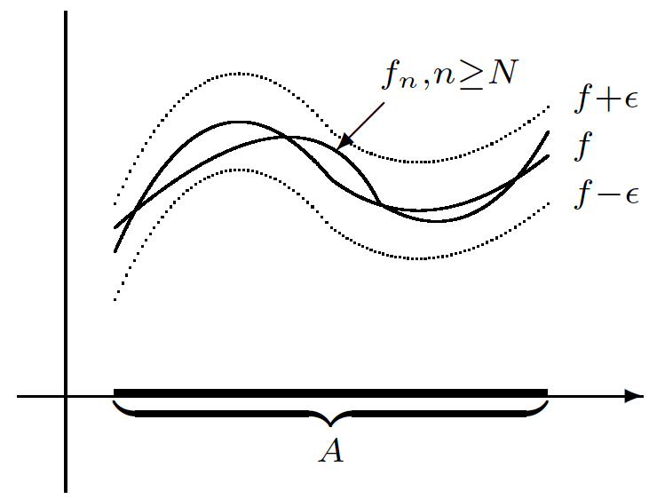

Topics:
- Abbott §6.2: Pointwise and uniform convergence

---

# Pointwise convergence

## Sequences of functions

Consider a **sequence of functions** $f_n : A \to \mathbb{R}$

1. What does "$f = \lim f_n$" mean?

2. Which properties of $f_n$ carry over to $f$?

---

## Pointwise convergence

**Definition:** consider $f_n : A \to \mathbb{R}$

$(f_n)$ **converges pointwise** to $f : A \to \mathbb{R}$ if for all **fixed** $x \in A$
$$
\lim f_n(x) = f(x)
$$

Thus: for each **fixed** $x \in A$ we have
$$
\forall\,\epsilon>0 \quad
\exists\,N_{\epsilon, x} \in \mathbb{N}
\quad\text{s.t.}\quad
n \geq N_{\epsilon, x}
\quad\Rightarrow\quad
|f_n(x)-f(x)| < \epsilon
$$
*[So $N$ depends on *both* $\epsilon$ and $x$!]*

---

## The classical example

**Example:** $f_n(x) = x^n$ gives
$$
f(x) = \lim f_n(x) = \begin{cases} 0 & \text{if } x < 1 \\ 1 & \text{if } x = 1 \end{cases}
\quad
\text{ on } A = [0,1]
$$

---

## The classical example

**Example (ctd):** let $\epsilon>0$ be arbitrary
$$\begin{aligned}
x = 0 \text{ or } 1 & : & \text{take } N_{\epsilon, x} = 1 \\[4mm]
n \geq N_{\epsilon, x} & \Rightarrow & |f_n(x)-f(x)| = 0 < \epsilon \\[8mm]
0 < x < 1 & : & \text{take } N_{\epsilon, x} > \frac{\log\epsilon}{\log x} \\[4mm]
n \geq N_{\epsilon, x} & \Rightarrow & |f_n(x)-f(x)| = |x^n-0| = x^n < \epsilon
\end{aligned}$$

*[Observe how $N$ depends on both $\epsilon$ and $x$!]*

---

## The triangle sequence

**Example:**
$f_n(x) =
\begin{cases}
2nx   & \text{if}\quad 0 \leq x < 1/2n      \\
2-2nx & \text{if}\quad 1/2n \leq x \leq 1/n \\
0     & \text{if}\quad 1/n \leq x \leq 1
\end{cases}$

Then $f(x) = \lim f_n(x)=0$ for all $x\in [0,1]$

---

## The triangle sequence

**Example (ctd):**
$$\begin{aligned}
0 < x \leq 1 & : & \text{take } N_{\epsilon,x} > 1/x \\[2mm]
n \geq N_{\epsilon,x} & \Rightarrow & \frac{1}{n} < x
\;\; \Rightarrow \;\; |f_n(x)-f(x)| = |0-0| = 0 < \epsilon
\end{aligned}$$

*[Observe how $N$ depends on $x$!]*

---

## The triangle sequence

**Example (ctd):**
$$\begin{aligned}
x=0 & : & \text{take } N_{\epsilon,x} =1 \\[2mm]
n \geq N_{\epsilon,x} & \Rightarrow & |f_n(x)-f(x)| = |0-0| = 0 < \epsilon
\end{aligned}$$

---

# Uniform convergence

## Uniform convergence

**Definition:** $(f_n)$ **converges uniformly** to $f : A \to \mathbb{R}$ if

$$
\forall\,\epsilon>0\quad
\exists\,N_\epsilon\in\mathbb{N}
\quad\text{s.t.}\quad
n \geq N_\epsilon
\quad\Rightarrow\quad
|f_n(x)-f(x)| < \epsilon
\quad
\forall\, x \in A
$$

**Note:** uniform means that **$N_\epsilon$ is independent of $x \in A$**

---

## Uniform convergence

*[Source: Stephen Abbott, *Understanding Analysis*, Springer, 2015]*

$f_n\to f$ uniformly means that for $n\geq N$ the graph of $f_n$ is within an **$\epsilon$-ribbon** around the graph of $f$

*[Note: the graph of $f_n$ lies within a $\epsilon$-tubular neighbourhood of the graph of $f$]*

---

## The classical example

**Example:** on $A=[0,1]$ the seq. $f_n(x)=x^n$ does **NOT** converge uniformly to
$$
f(x) = \begin{cases} 0 & \text{if } x < 1 \\ 1 & \text{if } x = 1 \end{cases}
$$
In the figure: $\epsilon=1/4$

---

## The triangle sequence

**Example:** the triangle sequence does **NOT** converge uniformly to $0$

(the dotted line is an $\epsilon$-ribbon around $f=0$ for $\epsilon=\tfrac{1}{2}$)

---

## A useful characterization

**Theorem:** if $f_n \to f$ uniformly on $A$, then
$$
\lim \left(\sup_{x\in A} |f_n(x)-f(x)|\right) = 0
$$

**Proof:** for any $\epsilon>0$ there exists $N_\epsilon\in\mathbb{N}$ such that
$$\begin{aligned}
n \geq N_\epsilon
& \Rightarrow & |f_n(x)-f(x)| < \epsilon \quad\forall\, x \in A \\[5mm]
& \Rightarrow & \sup_{x\in A} |f_n(x)-f(x)| \leq \epsilon
\end{aligned}$$

*[Note: $\sup_{x\in A} |f_n(x)-f(x)| \to 0$ implies that $|f_n-f|$ is bounded on $A$ for all $n$ sufficiently large]*

---

## A useful characterization

**Theorem:** if
$$
\lim\left(\sup_{x\in A} |f_n(x)-f(x)|\right) = 0
$$
then $f_n \to f$ uniformly on $A$

**Proof:** for any $\epsilon>0$ there exists $N_\epsilon\in\mathbb{N}$ such that
$$\begin{aligned}
n \geq N_\epsilon
& \Rightarrow & \sup_{x\in A} |f_n(x)-f(x)| < \epsilon \\[5mm]
& \Rightarrow & |f_n(x)-f(x)| < \epsilon \quad\forall\, x \in A
\end{aligned}$$

---

## A useful characterization

**Theorem:** consider $f_n : A \to \mathbb{R}$ then
$$
f_n \to f \text{ uniformly}
\quad\Leftrightarrow\quad
\lim \left(\sup_{x\in A} |f_n(x)-f(x)|\right) = 0
$$

**Notes:**
- $(\Rightarrow)$-proof shows: $|f_n-f|$ is bounded on $A$ for all $n$ suff. large

- If $|f_n-f|$ is not bounded on $A$ for all $n$ sufficiently large, then $f_n \to f$ is not uniform

---

## A useful characterization

**Example:** on $A=[0,1]$ the seq. $f_n(x)=x^n$ does **NOT** converge uniformly to
$$
f(x) = \begin{cases} 0 & \text{if } x < 1 \\ 1 & \text{if } x = 1 \end{cases}
$$

Reason: for all $n \in \mathbb{N}$ we have
$$
\sup_{x\in [0,1]} |f_n(x)-f(x)| = \sup_{x\in [0,1)} x^n = 1
$$

---

## A useful characterization

**Example:** the triangle sequence does **NOT** converge uniformly to zero since
$$
\sup_{x\in [0,1]} |f_n(x)-f(x)| = \sup_{x\in [0,1]} f_n(x) = 1
\quad\text{for all } n\in\mathbb{N}
$$

---

## A useful characterization

**Example:** $f_n(x) = (1-x)x^n\to 0$ uniformly on $A=[0,1]$

---

## A useful characterization

**Example:** $f_n(x) = (1-x)x^n\to 0$ uniformly on $A=[0,1]$

Calculus methods $\;\Rightarrow\; f_n(x)$ has a maximum at $x_n = \displaystyle\frac{n}{n+1}$ so

$$
\sup_{x\in [0,1]} |f_n(x)-0| = f_n(x_n) = \frac{1}{n+1}\left(\frac{n}{n+1}\right)^n < \frac{1}{n+1} \to 0
$$

---

## A useful characterization

**Example:** $f_n(x) = \displaystyle\frac{x^2}{1+nx^2}\to 0$ uniformly on $A=\mathbb{R}$

---

## A useful characterization

**Example (ctd):**
$$\begin{aligned}
x = 0     & \Rightarrow & f_n(x) = 0 \\[5mm]
x \neq  0 & \Rightarrow & f_n(x) = \frac{x^2}{1+nx^2} = \frac{1}{\displaystyle\frac{1}{x^2} + n} <
\frac{1}{n} \\[5mm]
& \Rightarrow & \sup_{x\in\mathbb{R}} |f_n(x)| \leq \frac{1}{n} \to 0
\end{aligned}$$

---

## Preservation of continuity

**Theorem:** assume $f_n : A \to \mathbb{R}$ satisfies

1. $f_n\to f$ uniformly on $A$

2. $f_n$ is continuous at $c \in A$ for all $n \in \mathbb{N}$

Then $f$ is continuous at $c$

**Moral:** uniform convergence "preserves" continuity!

---

## Preservation of continuity

**Proof:** for $\epsilon>0$ there exist

- $N\in\mathbb{N}$ s.t. $|f_N(x)-f(x)| < \tfrac{1}{3}\epsilon$ for all $x\in A$

- $\delta>0$ s.t. $|x-c| < \delta \;\;\Rightarrow\;\; |f_N(x)-f_N(c)| < \tfrac{1}{3}\epsilon$

If $|x-c|<\delta$ then
$$\begin{aligned}
|f(x) - f(c)|
& = & |f(x) - f_N(x) + f_N(x) - f_N(c) + f_N(c) - f(c)| \\[2mm]
& \leq & |f(x) - f_N(x)| + |f_N(x) - f_N(c)| + |f_N(c) - f(c)| \\[2mm]
& < & \tfrac{1}{3}\epsilon + \tfrac{1}{3}\epsilon + \tfrac{1}{3}\epsilon \\[2mm]
& = & \epsilon
\end{aligned}$$

---

## Preservation of continuity

**Example:** the seq. $f_n(x)=x^n$ does **NOT** uniformly converge to
$$
f(x) = \begin{cases} 0 & \text{if } x < 1 \\ 1 & \text{if } x = 1 \end{cases}
$$
on the set $A=[0,1]$

Reason: each $f_n$ is continuous at $x=1$, but the limit $f$ is not

---

## A word of caution...

**Exercise:** for $f_n(x) = x^n$, prove that
- $f_n\to 0$ uniformly on each set $A=[0,b]$ with $0 < b < 1$
- $f_n\to 0$ pointwise but **NOT** uniformly on $A=[0,1)$

**Moral:** whether or not we have uniform convergence also depends on the set $A$!
