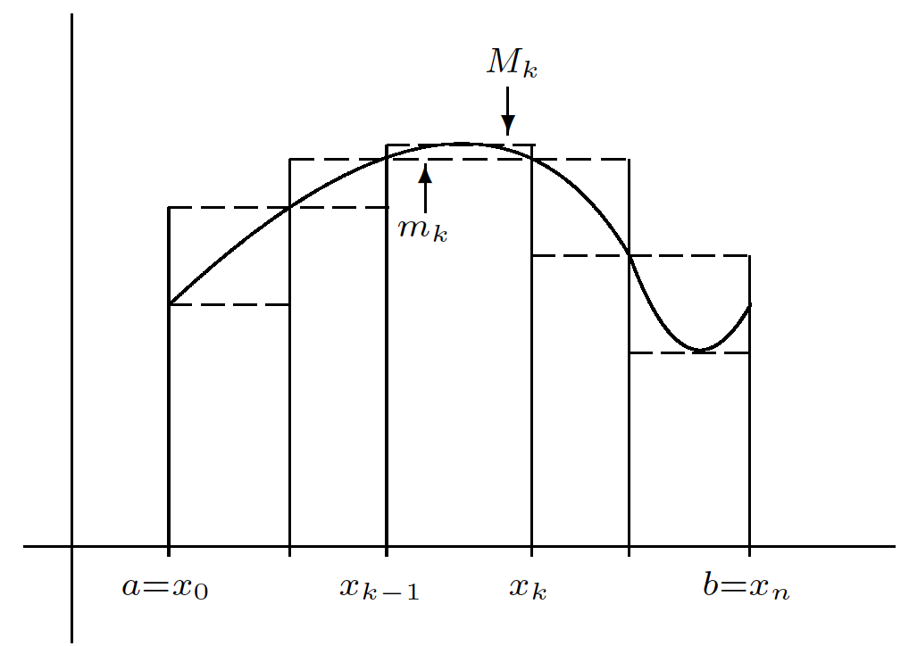
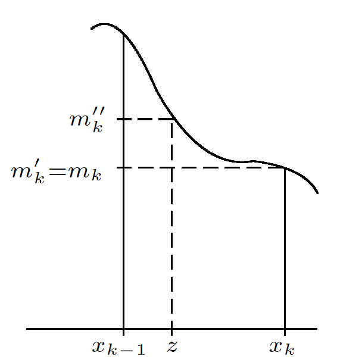

Topics:
- Abbott §7.2: the Riemann integral
- Abbott §7.3: integrals of discontinuous functions

---

# Upper and lower sums

## Partitions

**Definition:** a **partition** of $[a,b]$ is a set of the form
$$
P = \{a = x_0 < x_1 < x_2 < \dots < x_n = b\}
$$

**Examples:**

$P_1 = \{0, \tfrac{1}{4}, \tfrac{1}{2}, 1\}$ is a partition of $[0,1]$

$P_2 = \{0, 1, 2\}$ is NOT a partition of $[0,1]$

$P_3 = \{0, \tfrac{1}{2}\}$ is NOT a partition of $[0,1]$

---

## Lower sums

Let $f : [a,b]\to\mathbb{R}$ be bounded and $P$ be a partition of $[a,b]$

**Definition:** **lower sum** of $f$ w.r.t. $P$
$$\begin{aligned}
m_k & = \inf\{f(x) \,:\, x \in [x_{k-1},x_k]\} \\[5mm]
L(f,P) & = \sum_{k=1}^n m_k (x_k-x_{k-1})
\end{aligned}$$

"Approximate area below the graph of $f$"

---

## Upper sums

Let $f : [a,b]\to\mathbb{R}$ be bounded and $P$ be a partition of $[a,b]$

**Definition:** **upper sum** of $f$ w.r.t. $P$
$$\begin{aligned}
M_k & = \sup\{f(x) \,:\, x \in [x_{k-1},x_k]\} \\[5mm]
U(f,P) & = \sum_{k=1}^n M_k (x_k-x_{k-1})
\end{aligned}$$

"Approximate area above the graph of $f$"

---

## Approximate areas

*[Source: Stephen Abbott, *Understanding Analysis*, Springer, 2015]*

$L(f,P) \leq U(f,P)$ for any partition $P$ of $[a,b]$

---

## Refinements

**Definition:** $Q$ is called a **refinement** of $P$ if $P \subseteq Q$

*(Provided that $P$ and $Q$ are partitions of the same interval)*

**Example:**

$P = \{0, \tfrac{1}{2}, 1\}$ is a partition of $[0,1]$

$Q_1 = \{0, \tfrac{1}{4}, \tfrac{1}{2}, \tfrac{9}{10}, 1\}$ refines $P$

$Q_2 = \{0, \tfrac{1}{2}, 1, 2\}$ does NOT refine $P$

---

## Refinements

**Lemma:** if $P \subseteq Q$ then
$$
L(f,P) \leq L(f,Q)
\quad\text{and}\quad
U(f,P) \geq U(f,Q)
$$

**Corollary:** if $P \subseteq Q$ then
$$
U(f,Q) - L(f,Q) \leq U(f,P) - L(f,P)
$$

---

## Refinements

*[Source: Stephen Abbott, *Understanding Analysis*, Springer, 2015]*

---

## Refinements

**Proof (lower sum):** refine $P$ by adding one point $z \in [x_{k-1}, x_k]$
$$\begin{aligned}
m_k   & = \inf\{f(x) \,:\, x \in [x_{k-1},x_k]\} \\[3mm]
m_k'  & = \inf\{f(x) \,:\, x \in [z,x_k]\} \\[3mm]
m_k'' & = \inf\{f(x) \,:\, x \in [x_{k-1},z]\} \\[6mm]
m_k(x_k-x_{k-1}) & = m_k(x_k - z) + m_k (z - x_{k-1}) \\[3mm]
& \leq m_k'(x_k-z) + m_k'' (z-x_{k-1})
\end{aligned}$$

Then proceed by induction

---

## Refinements

**Lemma:** for any two partitions $P_1$ and $P_2$ we have
$$
L(f, P_1) \leq U(f, P_2)
$$

**Proof:** let $Q = P_1 \cup P_2$ then $P_1, P_2 \subseteq Q$ so
$$
L(f,P_1) \leq L(f,Q) \leq U(f,Q) \leq U(f,P_2)
$$

---

# The Riemann integral

## Best possible approximate area

Assume $f : [a,b] \to \mathbb{R}$ is bounded

Let $\mathcal{P}$ denote the collection of all partitions of $[a,b]$

**Definition:**
$$\begin{aligned}
U(f) & = \inf\{ U(f,P) \,:\, P \in \mathcal{P}\} \\[5mm]
L(f) & = \sup\{ L(f,P) \,:\, P \in \mathcal{P}\}
\end{aligned}$$

---

## Best possible approximate area

**Lemma:** $L(f) \leq U(f)$

**Proof:**
$$\begin{aligned}
L(f,P_1) & \leq U(f,P_2) \hspace{10mm} \text{for all } P_1, P_2 \in \mathcal{P} \\[3mm]
L(f) & \leq U(f,P_2) \hspace{10mm} \text{for all } P_2 \in \mathcal{P} \text{ (take sup over $P_1$)}\\[3mm]
L(f) & \leq U(f) \hspace{16mm}\text{(take inf over $P_2$)}
\end{aligned}$$

---

## The Riemann integral

**Definition:** a bounded function $f : [a,b] \to \mathbb{R}$ is called **Riemann integrable** if $U(f) = L(f)$

**Notation:**
$$
\int_a^b f = U(f) = L(f)
\qquad\text{or}\qquad
\int_a^b f(x)dx = U(f) = L(f)
$$

---

## Criterion for integrability

**Theorem:** the following statements are equivalent

1. $f$ is integrable
2. for all $\epsilon>0$ there exists a partition $P_\epsilon$ such that
   $$
   U(f,P_\epsilon) - L(f,P_\epsilon) < \epsilon
   $$

**Proof ($2 \Rightarrow 1$):**
$$
\left.
\begin{matrix}
U(f) & \leq & U(f,P_\epsilon) \\[3mm]
L(f) & \geq & L(f,P_\epsilon)
\end{matrix}
\right\}
\quad\Rightarrow\quad
U(f)-L(f) \leq U(f,P_\epsilon) - L(f,P_\epsilon) < \epsilon
$$

This holds for all $\epsilon>0$ so $U(f)=L(f)$

---

## Criterion for integrability

**Proof ($1 \Rightarrow 2$)**: let $\epsilon>0$ and choose $P_1$ and $P_2$ such that
$$
L(f,P_1) > L(f) - \tfrac{1}{2}\epsilon
\quad\text{and}\quad
U(f,P_2) < U(f) + \tfrac{1}{2}\epsilon
$$

Let $P_\epsilon = P_1 \cup P_2$ then
$$\begin{aligned}
U(f,P_\epsilon) - L(f,P_\epsilon) & \leq U(f,P_2) - L(f,P_1) \\[3mm]
& = \big[U(f, P_2) - U(f)\big] + \big[L(f) - L(f,P_1)\big] \\[3mm]
& < \tfrac{1}{2}\epsilon + \tfrac{1}{2}\epsilon \\[3mm]
& = \epsilon
\end{aligned}$$

---

## Continuous functions are integrable

**Theorem:** $f$ continuous on $[a,b] \;\Rightarrow\; f$ integrable on $[a,b]$

**Proof:** $f$ is uniformly continuous on $[a,b]$

For all $\epsilon>0$ there exists $\delta>0$ such that
$$
|x-y| < \delta \quad\Rightarrow\quad |f(x)-f(y)| < \frac{\epsilon}{b-a} \qquad\text{for all } x,y \in [a,b]
$$

Let $P$ be a partition such that $x_k - x_{k-1} < \delta$ for all $k=1,\dots,n$

---

## Continuous functions are integrable

**Proof (ctd):** there exist $y_k, z_k \in [x_{k-1},x_k]$ such that
$$
f(y_k) = M_k
\qquad\text{and}\qquad
f(z_k) = m_k
$$

Note
$$
|y_k-z_k| < \delta
\quad\Rightarrow\quad
M_k - m_k = f(y_k) - f(z_k) < \frac{\epsilon}{b-a}
$$

---

## Continuous functions are integrable

**Proof (ctd):**
$$\begin{aligned}
U(f,P)-L(f,P) & = \sum_{k=1}^n (M_k-m_k)(x_k - x_{k-1}) \\[4mm]
& < \frac{\epsilon}{b-a}\sum_{k=1}^n (x_k - x_{k-1}) \\[4mm]
& = \frac{\epsilon}{b-a}\cdot (b-a) \;\; = \;\; \epsilon
\end{aligned}$$

---

# Integrals of discontinuous functions

## Integrals of discontinuous functions

**Example:** $f(x) = \begin{cases} 1 & \text{if } x\neq 1 \\ 0 & \text{if } x=1\end{cases}$
is integrable on $[0,2]$

Let $0<\epsilon<1$ and take the partition
$$\begin{aligned}
P & = \{0, 1 - \tfrac{1}{4}\epsilon, 1+\tfrac{1}{4}\epsilon, 2\} \\[3mm]
U(f,P) & = 2 \\[3mm]
L(f,P) & = 2-\tfrac{1}{2}\epsilon \\[3mm]
U(f,P) - L(f, P) & < \epsilon
\end{aligned}$$

*[What if $\epsilon \geq 1$?]*

---

## Integrals of discontinuous functions

*[Source: Stephen Abbott, *Understanding Analysis*, Springer, 2015]*

**Example:**
$f(x) = \begin{cases} 1 & \text{if } x \in \mathbb{Q} \\ 0 & \text{if } x \notin\mathbb{Q}\end{cases}$
is NOT integrable on $[0,1]$

---

## Integrals of discontinuous functions

Let $P$ be any partition of $[0,1]$ then
$$\begin{aligned}
[x_{k-1},x_k]\cap\mathbb{Q}^c \neq \varnothing
& \Rightarrow m_k=0 \text{ for all } k=1,\dots,n \\[3mm]
& \Rightarrow L(f,P) = 0 \\[6mm]
[x_{k-1},x_k]\cap\mathbb{Q} \neq \varnothing
& \Rightarrow M_k=1 \text{ for all } k=1,\dots,n \\[3mm]
& \Rightarrow U(f,P) = 1
\end{aligned}$$

---

## Integrals of discontinuous functions

**Example:** any **increasing** function $f : [a,b]\to\mathbb{R}$ is integrable

For **any** partition of $[a,b]$ we have
$$\begin{aligned}
M_k & = \sup\{f(x) \,:\, x \in [x_{k-1},x_k]\} \\[2mm]
& = f(x_k) \\[6mm]
m_k & = \inf\{f(x) \,:\, x \in [x_{k-1},x_k]\} \\[2mm]
& = f(x_{k-1})
\end{aligned}$$

---

## Integrals of discontinuous functions

**Example (ctd):** an **equispaced** partition $P$ gives
$$\begin{aligned}
U(f,P) - L(f,P)
& = \sum_{k=1}^n (M_k-m_k)(x_k-x_{k-1}) \\[2mm]
& = \frac{(b-a)}{n} \sum_{k=1}^n \big[f(x_k)-f(x_{k-1})\big] \\[2mm]
& = \frac{(b-a)(f(b)-f(a))}{n} \to 0 \quad\text{ as }\quad n \to \infty
\end{aligned}$$

**Exercise:** show that decreasing functions are also integrable
