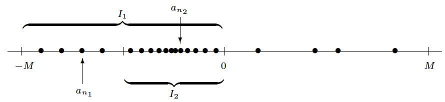
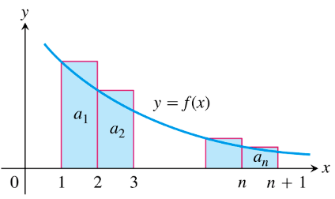
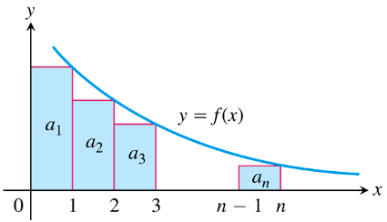

Topics:
- Abbott §2.4. The monotone convergence theorem
- Abbott §2.5. The Bolzano--Weierstrass theorem

Formalization: [`Sequences.v`](docs/rocq/RUG.Analysis.Sequences.html), [`Subsequences.v`](docs/rocq/RUG.Analysis.Subsequences.html), [`Series.v`](docs/rocq/RUG.Analysis.Series.html)

---

# Monotone sequences

## Sequences and limits

**Definition:** $(a_n)$ **converges** to $a$ if
$$
\forall\,\epsilon>0 \quad\exists\,N \in \mathbb{N} \quad\text{s.t.}\quad
n \geq N \quad\Rightarrow\quad |a_n - a| < \epsilon
$$

**Notation:** $a = \lim a_n$ or $a_n \rightarrow a$

*[Source: Stephen Abbott, *Understanding Analysis*, Springer, 2015]*

---

## Monotone sequences

**Definition:** $(a_n)$ is called **monotone** if it is either

- increasing: $\quad\; a_n \leq a_{n+1} \quad\forall\,n \in \mathbb{N}$

  or

- decreasing: $\quad a_{n+1} \leq a_n \quad\forall\,n \in \mathbb{N}$

**Examples:**
- $(a_n) = (1,\tfrac{1}{2},\tfrac{1}{3},\tfrac{1}{4},\dots)$ is monotone
- $(b_n) = (1,1,2,2,4,4,8,8,\dots)$ is monotone
- $(c_n) = (1,0,1,0,\dots)$ is **NOT** monotone

---

## Monotone convergence theorem

**Theorem:** $(a_n)$ bounded & monotone $\;\Rightarrow\; (a_n)$ converges

**Proof:** $A = \{a_n \,:\, n \in \mathbb{N}\}$ is bounded

Strategy of proof:

- $a_n$ increasing $\;\Rightarrow\; \lim a_n = \sup A$
- $a_n$ decreasing $\;\Rightarrow\; \lim a_n = \inf A$ (exercise!)

---

## Monotone convergence theorem

**Proof (ctd):** assume that $(a_n)$ increases

Let $s=\sup\{a_n \,:\, n \in \mathbb{N}\}$

Let $\epsilon>0$ be arbitrary, then $s-\epsilon$ is not an upper bound

There exists $N \in \mathbb{N}$ s.t. $s-\epsilon < a_N$

For $n \geq N$ we have
$$
s-\epsilon < a_N \leq a_n \leq s < s+\epsilon \quad\Rightarrow\quad |a_n-s| < \epsilon
$$

---

## Monotone convergence theorem

**Example:** if $a_{n+1} = \sqrt{1+a_n}$ with $a_1=1$ then $(a_n)$ converges

Induction proof that $(a_n)$ is increasing:
$$\begin{aligned}
a_1 = 1, \;\; a_2 = \sqrt{2} & \Rightarrow & a_1 < a_2 \\[5mm]
a_n < a_{n+1} \text{ for some } n	& \Rightarrow & 1 + a_n < 1 + a_{n+1} \\[3mm]
               					& \Rightarrow & \sqrt{1+a_n} < \sqrt{1+a_{n+1}} \\[3mm]
              						& \Rightarrow & a_{n+1} < a_{n+2}
\end{aligned}$$

---

## Monotone convergence theorem

**Example:** if $a_{n+1} = \sqrt{1+a_n}$ with $a_1=1$ then $(a_n)$ converges

Induction proof that $(a_n)$ is bounded:
$$\begin{aligned}
a_1 = 1 & \Rightarrow & a_1 < 2 \\[5mm]
a_n < 2 \text{ for some } n	& \Rightarrow & 1 + a_n < 3 \\[3mm]
         						& \Rightarrow & \sqrt{1+a_n} < \sqrt{3} < 2 \\[3mm]
        						& \Rightarrow & a_{n+1} < 2
\end{aligned}$$

---

## Monotone convergence theorem

**Example:** if $a_{n+1} = \sqrt{1+a_n}$ with $a_1=1$ then $(a_n)$ converges

$(a_n)$ bounded and increasing $\;\Rightarrow\;$ $a = \lim a_n$ exists by MCT

Moreover:
$$
\begin{split}
a_{n+1}^2 = 1 + a_n
 & \quad\Rightarrow\quad \lim a_{n+1}^2 = \lim\,(1+a_n) \\[4mm]
 & \quad\Rightarrow\quad a^2 = 1 + a \\[2mm]
 & \quad\Rightarrow\quad a = \frac{1+\sqrt{5}}{2}
\end{split}
$$

---

# Subsequences

## Subsequences

**Definition:** pick $n_k \in \mathbb{N}$ such that
$$
1 \leq n_1 < n_2 < n_3 < \cdots
$$
If $(a_n)$ is a sequence then
$$
(a_{n_k}) = (a_{n_1}, a_{n_2}, a_{n_3}, \dots)
$$
is called a **subsequence** of $(a_n)$

**Note:** $n_k \geq k$ for all $k \in \mathbb{N}$

---

## Subsequences

**Example:** consider
$$
(a_n) = (a_1, a_2, a_3, a_4, a_5,\dots)
$$

Some subsequences are given by:
$$\begin{aligned}
n_k = k+4
 & \quad\Rightarrow\quad &
(a_{n_k}) = (a_5, a_6, a_7,\dots) \\[5mm]
n_k = 2k
 & \quad\Rightarrow\quad &
(a_{n_k}) = (a_2, a_4, a_6,\dots) \\[5mm]
n_k = 10^k & \quad\Rightarrow\quad &
(a_{n_k}) = (a_{10}, a_{100}, a_{1000},\dots)
\end{aligned}$$

---

## Subsequences

**Warning:** the indices $n_k$ must be **strictly increasing**!

The following examples **DO NOT** qualify as subsequences of $(a_n)$:
- $(a_3, a_5, a_1, a_7, a_2,\dots)$
  *[the ordering of the terms is not respected]*
- $(a_1, a_1, a_2, a_3, a_4,\dots)$
  *[repetitions are not allowed]*

---

## Subsequences

**Theorem:** $\lim a_n = a \quad\Rightarrow\quad \lim a_{n_k} = a$

**Proof:** let $\epsilon>0$ be arbitrary, then

$$\begin{aligned}
\exists\, N \in \mathbb{N} \quad \text{s.t.}\quad n \geq N & \Rightarrow & |a_n - a| < \epsilon \\[5mm]
k \geq N & \Rightarrow & n_k \geq N \qquad\qquad\quad \text{(use $n_k\geq k$)} \\[2mm]
          & \Rightarrow & |a_{n_k} - a| < \epsilon
\end{aligned}$$

---

## Subsequences

**Example:** $(a_n) = (-1,1,-1,1,\dots)$ diverges

Take two subsequences:
$$\begin{aligned}
n_k = 2k   & \quad\Rightarrow\quad & (a_{n_k}) = (1,1,1,\dots) \\[2mm]
           & \quad\Rightarrow\quad & \lim a_{n_k} = 1 \\[5mm]
n_k = 2k-1 & \quad\Rightarrow\quad & (a_{n_k}) = (-1,-1,-1,\dots) \\[2mm]
           & \quad\Rightarrow\quad & \lim a_{n_k} = -1
\end{aligned}$$

Different subsequences have different limits $\;\Rightarrow\;$ $(a_n)$ diverges

---

## Bolzano--Weierstrass theorem

**Theorem:** every bounded sequence has a convergent subsequence

**Proof:** there exists $M>0$ such that $a_n \in [-M, M]$ for all $n$

*[Source: Stephen Abbott, *Understanding Analysis*, Springer, 2015]*

Halving-process gives nested closed intervals
$$
I_1 \supseteq I_2 \supseteq I_3 \supseteq \cdots
$$
NIP $\Rightarrow$ there exists $x\in \bigcap_{n=1}^\infty I_n$

---

## Bolzano--Weierstrass theorem

**Proof (ctd):** each $I_k$ contains **infinitely many** terms of the seq.
- pick $n_1 \in \mathbb{N}$ with $a_{n_1} \in I_1$
- pick $n_2 \in \mathbb{N}$ with $n_2 > n_1$ and $a_{n_2} \in I_2$
- pick $n_3 \in \mathbb{N}$ with $n_3 > n_2$ and $a_{n_3} \in I_3$
  $\quad\quad\vdots$

Note that
$$
\left.
\begin{matrix*}
x & \in & I_k \\[2mm]
a_{n_k} & \in & I_k
\end{matrix*}
\right\}
\quad\Rightarrow\quad
|a_{n_k} - x| \leq \text{length}(I_k) = \frac{2M}{2^k} \to 0
$$

---

# Introduction to series

## How to add infinitely many numbers?

**Definition:**
- infinite **series**:
$$
\sum_{k=1}^\infty a_k = a_1 + a_2 + a_3 + \cdots
$$
- $n$-th **partial sum**:
$$
s_n = a_1 + a_2 + \dots + a_n
$$
- if $\lim s_n = s$, then we say the series **converges** to $s$

---

## Euler's famous example

**Theorem:** $\displaystyle\sum_{k=1}^\infty \frac{1}{k^2}$ converges

**Proof:**
$$\begin{aligned}
s_n & = & 1 + \frac{1}{4} + \frac{1}{9} + \dots + \frac{1}{n^2} \\[5mm]
s_n & < & s_{n+1} \qquad\forall\, n \in \mathbb{N} \\[5mm]
s_n & < & 2 \qquad\forall\, n \in \mathbb{N} \qquad \text{*(see next slide)*}\\[5mm]
\text{MCT} & \Rightarrow & \lim s_n \text{ exists}
\end{aligned}$$

---

## Euler's famous example

**Proof (ctd):**
$$\begin{aligned}
s_n
 & = & 1 + \frac{1}{2 \cdot 2} + \frac{1}{3 \cdot 3} + \frac{1}{4 \cdot 4} + \dots + \frac{1}{n\cdot n} \\[4mm]
  & < & 1 + \frac{1}{2 \cdot 1} + \frac{1}{3 \cdot 2} + \frac{1}{4 \cdot 3} + \dots + \frac{1}{n\cdot (n-1)} \\[4mm]
  & = & 1 + \left(1-\frac{1}{2}\right) + \left(\frac{1}{2}-\frac{1}{3}\right) + \left(\frac{1}{3}-\frac{1}{4}\right) + \dots + \left(\frac{1}{n-1}-\frac{1}{n}\right) \\[4mm]
  & = & 1 + 1 - \frac{1}{n} \\[4mm]
  & < & 2
\end{aligned}$$

---

## Euler's famous example

**Remark:** since $s_n < 2$ for all $n$ the order limit theorem implies
$$
\sum_{k=1}^\infty \frac{1}{k^2} = \lim s_n \leq 2
$$

Euler proved in 1734 that in fact
$$
\sum_{k=1}^\infty \frac{1}{k^2} = \frac{\pi^2}{6} = 1.644934\dots
$$

---

## More curious examples...

$$\begin{aligned}
\sum_{k=1}^\infty \frac{1}{k^4} & = & \frac{\pi^4}{90} \\[4mm]
\sum_{k=1}^\infty \frac{1}{k^6} & = & \frac{\pi^6}{945} \\[4mm]
\sum_{k=1}^\infty \frac{1}{k^8} & = & \frac{\pi^8}{9450} \\
 & \vdots &
\end{aligned}$$

For odd powers of $k$ the sums are unknown!

---

## The harmonic series

**Theorem:** $\displaystyle\sum_{k=1}^\infty \frac{1}{k}$ **diverges**

**Proof:**
$$\begin{aligned}
s_n & = & 1 + \frac{1}{2} + \frac{1}{3} + \frac{1}{4} + \dots + \frac{1}{n} \\[6mm]
s_{2^p} & \geq & 1 + \frac{p}{2} \qquad\text{for all $p\in\mathbb{N}$ (see book)}
\end{aligned}$$

$(s_n)$ is unbounded and therefore divergent

---

## The integral test for convergence

**Theorem:** assume that $f : [1,\infty) \to \mathbb{R}$ is
1. positive
2. continuous
3. monotonically decreasing

Let $a_k=f(k)$ then
$$
\sum_{k=1}^\infty a_k \text{ converges}
\qquad\Leftrightarrow\qquad
\displaystyle\int_1^\infty f(x) dx < \infty
$$

---

## The integral test for convergence

*[Source: James Stewart, *Calculus Early Transcendentals*, 7th edition, Cengage, 2012]*

**Proof:** on the one hand
$$
\displaystyle\int_1^{n+1} f(x) dx \leq a_1 + a_2 + \cdots + a_n
$$

---

## The integral test for convergence

*[Source: James Stewart, *Calculus Early Transcendentals*, 7th edition, Cengage, 2012]*

**Proof (ctd):** on the other hand
$$
a_1 + a_2 + \cdots + a_n \leq a_1 + \displaystyle\int_1^n f(x) dx
$$

---

## The integral test for convergence

**Proof (ctd):** for all $n \in \mathbb{N}$ we have
$$
\int_1^{n+1} f(x) dx
\;\leq\;
\underbrace{a_1 + a_2 + \cdots + a_n}_{s_n}
\;\leq\;
a_1 + \int_1^n f(x) dx
$$

Note that $(s_n)$ is increasing since all $a_k > 0$!

If $\int_1^\infty f(x)\,dx < \infty$, then $(s_n)$ also bounded and hence convergent

If $\int_1^\infty f(x)\,dx = \infty$, then $(s_n)$ unbounded and hence divergent

---

## The integral test for convergence

**Example:** $\displaystyle\sum_{k=1}^\infty \frac{1}{k^p}$ converges $\;\Leftrightarrow\; p>1$

**Proof:** apply the theorem with $f(x) = \displaystyle\frac{1}{x^p}$

---

## The integral test for convergence

**Example:** $\displaystyle\sum_{k=1}^\infty ke^{-k^2}$ converges

**Proof:**
$$
\begin{split}
f(x) = xe^{-x^2}
\quad\Rightarrow\quad
\int_1^b f(x)\,dx
& = \bigg[-\tfrac{1}{2}e^{-x^2}\bigg]_1^b \\[4mm]
& = \tfrac{1}{2}(e^{-1}-e^{-b^2}) \to \tfrac{1}{2}e^{-1} \\[4mm]
& \quad\;\,\text{as } b \to \infty
\end{split}
$$
