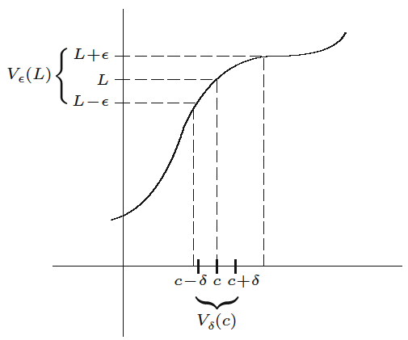
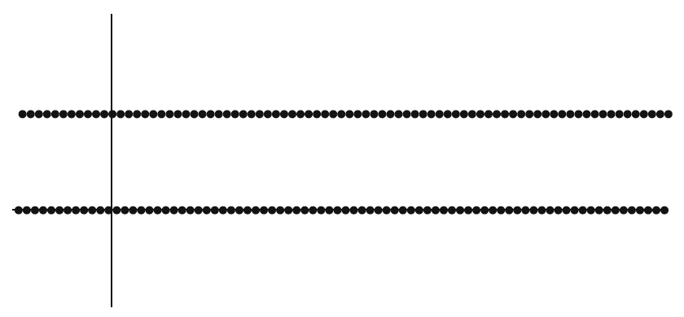
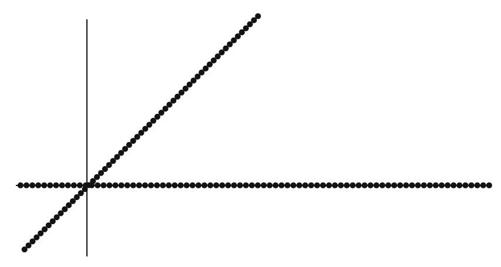
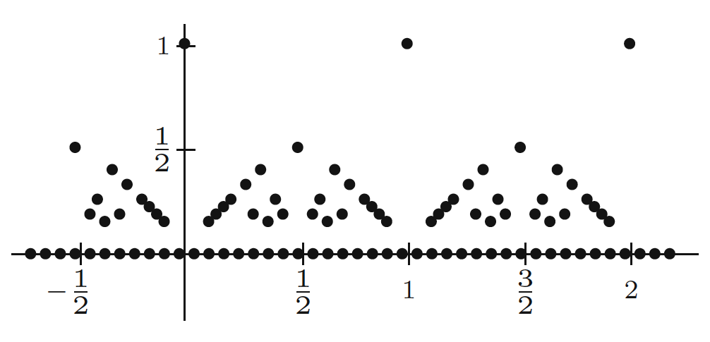

Topics:
- Abbott §4.2. Limits of functions
- Abbott §4.3. Continuity

Formalization: [`Limits.v`](docs/rocq/RUG.Analysis.Limits.html), [`Continuity.v`](docs/rocq/RUG.Analysis.Continuity.html)

---

# Functional limits

## Limit of a function

Let $f : A \to \mathbb{R}$ and $c$ a **limit point** of $A$.

**Question:** if $\lim f(x_n)=L$ **for all** $(x_n)\subseteq A$ with $x_n\neq c$ and $\lim x_n = c$, can we claim that
$$
\displaystyle\lim_{x\to c} f(x) = L
$$
in the sense of the definition from Calculus 1?

---

## $\epsilon$ and $\delta$ definition

**Definition:** let $f : A \to \mathbb{R}$ and $c$ a **limit point** of $A$

We say that $\displaystyle\lim_{x\to c} f(x) = L$ when

$$
\forall\,\epsilon>0\quad
\exists\,\delta>0\quad\text{s.t.}\quad
0 < |x - c| < \delta,\; x \in A
\quad\Rightarrow\quad
|f(x) - L| < \epsilon
$$

**Note:** $f$ **need not** be defined at $c$

---

## $\epsilon$ and $\delta$ definition

*[Source: Stephen Abbott, *Understanding Analysis*, Springer, 2015]*

---

## $\epsilon$ and $\delta$ definition

**Example:** $\displaystyle\lim_{x\to 2} \frac{x^2+x-6}{5x-10} = 1$

Let $\epsilon>0$ be arbitrary.

If $0 < |x-2| < \delta$, then
$$\begin{aligned}
\bigg|\frac{x^2+x-6}{5x-10} - 1\bigg|
& = \bigg|\frac{(x+3)(x-2)}{5(x-2)} - 1\bigg| \\[2mm]
& = \bigg|\frac{x+3}{5} - 1\bigg| \\[2mm]
& = \frac{|x-2|}{5} < \frac{\delta}{5} = \epsilon
\end{aligned}$$
by choosing $\delta = 5\epsilon$

---

## $\epsilon$ and $\delta$ definition

**Example:** $\displaystyle\lim_{x\to c} \sqrt{x} = \sqrt{c}$ when $c > 0$

$$\begin{aligned}
\left|\sqrt{x}-\sqrt{c}\right| & = \left|\frac{x-c}{\sqrt{x}+\sqrt{c}}\right| \\[4mm]
& = \frac{|x-c|}{\sqrt{x}+\sqrt{c}} \\[4mm]
& \leq \frac{|x-c|}{\sqrt{c}}
\end{aligned}$$

With $\epsilon>0$ and $\delta = \sqrt{c}\cdot\epsilon$ the definition is satisfied

*Exercise: adapt the proof for $c=0$*

---

## Sequential characterization

**Theorem:** let $f : A \to \mathbb{R}$ and $c$ a **limit point** of $A$

The following statements are equivalent

1. $\displaystyle\lim_{x\to c} f(x) = L$

2. $\lim f(x_n)=L$ **for all** $(x_n)\subseteq A$ with $x_n\neq c$ and $\lim x_n = c$

**Proof:** see book

---

## Sequential characterization

**Corollary:** consider $f : A \to \mathbb{R}$ and let $c$ be a limit point of $A$

$\displaystyle\lim_{x\to c} f(x)$ does **NOT** exist if there exist $(x_n), (y_n)\subseteq A$ s.t.

- $x_n \neq c$ and $y_n\neq c$

- $\lim x_n = \lim y_n = c$

- $\lim f(x_n) \neq \lim f(y_n)$

---

## Sequential characterization

**Example:** $\displaystyle\lim_{x\to 0} f(x)$ does not exist for
$$
f(x) = \begin{cases} 1 & \text{if } x \in \mathbb{Q} \\ 0 & \text{if } x \notin\mathbb{Q} \end{cases}
$$

Take $x_n = 1/n$ and $y_n = \sqrt{2}/n$ then

- $\lim x_n = \lim y_n = 0$

- $\lim f(x_n) = 1$

- $\lim f(y_n) = 0$

---

## Algebraic properties

**Theorem:** let $f, g : A \to \mathbb{R}$, $c$ a limit point of $A$, and
$$
\lim_{x\to c} f(x) = L
\quad\text{and}\quad
\lim_{x\to c} g(x) = M
$$
Then

1. $\displaystyle\lim_{x\to c} kf(x) = kL \quad (k \in \mathbb{R})$

2. $\displaystyle\lim_{x\to c} f(x)+g(x) = L+M$

3. $\displaystyle\lim_{x\to c} f(x)g(x) = LM$

4. $\displaystyle\lim_{x\to c} f(x)/g(x) = L/M \qquad$ (provided $M\neq 0$)

---

# Continuity

## $\epsilon$ and $\delta$ definition

**Definition:** $f : A \to \mathbb{R}$ is **continuous** at $c \in A$ if
$$
\forall\,\epsilon>0 \quad
\exists\,\delta>0\quad\text{s.t.}\quad
|x - c| < \delta,\; x \in A
\quad\Rightarrow\quad
|f(x)-f(c)| < \epsilon
$$

**Notes:**

- $f(c)$ needs to be defined, but $c$ **need not** be a limit point of $A$

- $\delta$ may depend on both $\epsilon$ and $c$

---

## $\epsilon$ and $\delta$ definition

**Example:** if $c\in A$ is **isolated** then $f : A \to \mathbb{R}$ is continuous at $c$

Let $\epsilon > 0$ be arbitrary

Take $\delta>0$ such that $V_\delta(c)\cap A = \{c\}$, then

$$\begin{aligned}
|x-c| < \delta \text{ and } x\in A
& \Rightarrow x \in V_\delta(c)\cap A \\[3mm]
& \Rightarrow x = c \\[3mm]
& \Rightarrow f(x) = f(c) \\[3mm]
& \Rightarrow |f(x)-f(c)| = 0 < \epsilon
\end{aligned}$$

---

## $\epsilon$ and $\delta$ definition

**Example:** $f(x) = x^2$ is continuous at every point $c\in\mathbb{R}$

For $|x-c|<1$ we have $|x| < |c|+1$ and

$$\begin{aligned}
|f(x)-f(c)|
& = |x^2-c^2| \\[3mm]
& = |x+c|\,|x-c| \\[3mm]
& \leq (|x| + |c|)\,|x-c| \\[3mm]
& \leq (2|c|+1)|x-c|
\end{aligned}$$

For a given $\epsilon>0$ take $\delta = \min\left\{1, \displaystyle\frac{\epsilon}{2|c|+1}\right\}$

---

## $\epsilon$ and $\delta$ definition

**Example:** $f(x) = |x|$ is continuous at every $c\in\mathbb{R}$

For all $x,c\in\mathbb{R}$ we have
$$
\big|f(x)-f(c)\big| = \big| |x|-|c| \big| \leq \big|x-c\big|
$$

For a given $\epsilon>0$ take $\delta = \epsilon$

**Note:** $\delta$ independent of $c$ in this example

---

## Sequential characterization

**Theorem:** let $f : A \to \mathbb{R}$ and $c \in A$

The following statements are equivalent:

1. $f$ is continuous at $c$

2. $(x_n) \subseteq A$ and $\lim x_n = c \;\Rightarrow\; \lim f(x_n) = f(c)$

If $c$ is a limit point of $A$ then 1 and 2 are also equivalent with

3. $\displaystyle\lim_{x \to c} f(x) = f(c)$

**Proof:** see book

---

## Sequential characterization

**Corollary:** let $f : A \to \mathbb{R}$ and $c\in A$ a limit point

$f$ is **NOT** continuous at $x=c$ if there exists $(x_n) \subseteq A$ s.t.

- $x_n \neq c$

- $\lim x_n = c$

- $\lim f(x_n) \neq f(c)$

---

## Sequential characterization

**Example:** there exists no number $a \in \mathbb{R}$ that makes
$$
f(x) = \begin{cases} \sin(1/x) & \text{if } x \neq 0 \\ a & \text{if } x = 0 \end{cases}
$$
continuous at $x=0$

- if $a \neq 0$, then with $x_n = 1/(n\pi)$ we have
  $\lim x_n = 0$ but $\lim f(x_n) = 0 \neq a = f(0)$

- if $a = 0$, then with $x_n = 1/(2n\pi + \pi/2)$ we have
  $\lim x_n = 0$ but $\lim f(x_n) = 1 \neq a = f(0)$

---

# Pathologies

## Dirichlet's function

*[Source: Stephen Abbott, *Understanding Analysis*, Springer, 2015]*

$g(x) = \begin{cases} 1 & \text{if } x \in \mathbb{Q} \\ 0 & \text{if } x \notin\mathbb{Q} \end{cases}$ is **NOWHERE** continuous!

---

## Dirichlet's function

$g(x) = \begin{cases} 1 & \text{if } x \in \mathbb{Q} \\ 0 & \text{if } x \notin\mathbb{Q} \end{cases}$

**Proof** of discontinuity at $c \in \mathbb{Q}$:

Take $x_n = c + \displaystyle\frac{\sqrt{2}}{n}$ (note: $x_n \notin \mathbb{Q}$)

Then $\lim x_n = c$

But $\lim g(x_n) = 0 \neq g(c)$

---

## Dirichlet's function

**Proof** of discontinuity at $c \in \mathbb{R}\setminus \mathbb{Q}$:

Take $x_n \in \mathbb{Q}$ s.t. $|x_n-c| < \frac{1}{n}$ for all $n\in\mathbb{N}$ ($\mathbb{Q}$ is dense in $\mathbb{R}$!)

Then $\lim x_n = c$

But $\lim g(x_n) = 1 \neq g(c)$

---

## Modified Dirichlet's function

*[Source: Stephen Abbott, *Understanding Analysis*, Springer, 2015]*

$h(x) = \begin{cases} x & \text{if } x \in \mathbb{Q} \\ 0 & \text{if } x \notin\mathbb{Q} \end{cases}$ is **ONLY** continuous at $x = 0$!

---

## Modified Dirichlet's function

Continuity at $c=0$ follows from $|h(x)| \leq |x|$:

- either use $\lim x_n = 0 \;\Rightarrow\; \lim h(x_n) = 0$

- or use $\epsilon$ and $\delta$ definition

Proof of discontinuity at $c \neq 0$ as for Dirichlet's function

---

## Thomae's function

*[Source: Stephen Abbott, *Understanding Analysis*, Springer, 2015]*

$t(x) = \begin{cases} 1 & \text{if } x=0 \\ 1/n & \text{if } x = m/n \in\mathbb{Q}\setminus\{0\} \text{ in lowest terms with } n > 0 \\ 0 & \text{if } x \notin \mathbb{Q}\end{cases}$

Discontinuous at each $c \in \mathbb{Q}$, but continuous at each $c \in \mathbb{R}\setminus\mathbb{Q}$!

---

## Thomae's function

**Proof** of discontinuity at $c \in \mathbb{Q}$:

Take $x_n = c + \displaystyle\frac{\sqrt{2}}{n}$ (note: $x_n \notin \mathbb{Q}$)

Then $\lim x_n = c$

But $\lim t(x_n) = 0 \neq t(c) > 0$

---

## Thomae's function

**Proof** of continuity at $c \in \mathbb{R} \setminus \mathbb{Q}$

Let $\epsilon > 0$ and pick $k \in \mathbb{N}$ with $\displaystyle\frac{1}{k} < \epsilon$

$(c-1,c+1)$ contains **finitely** many $r \in \mathbb{Q}$ with denominator $\leq k$

Pick $0 < \delta < 1$ such that $(c-\delta, c+\delta)$ contains no rationals with denominator $\leq k$, then
$$
|x - c| < \delta
\quad\Rightarrow\quad
|t(x) - t(c)| = |t(x)| = t(x) < \frac{1}{k} < \epsilon
$$
